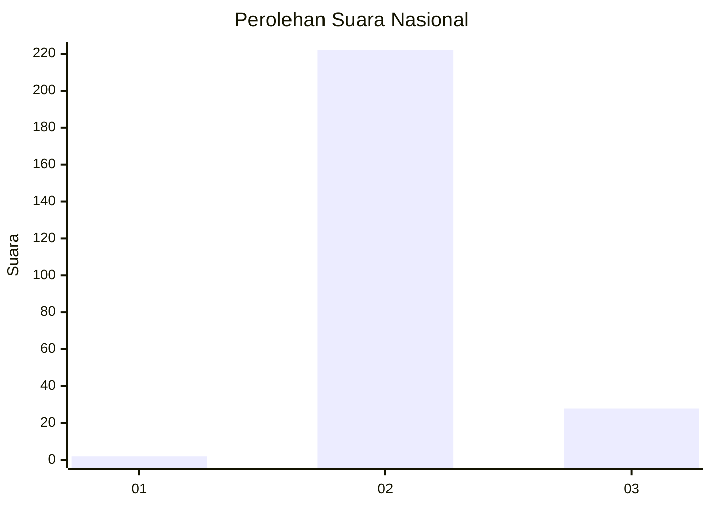
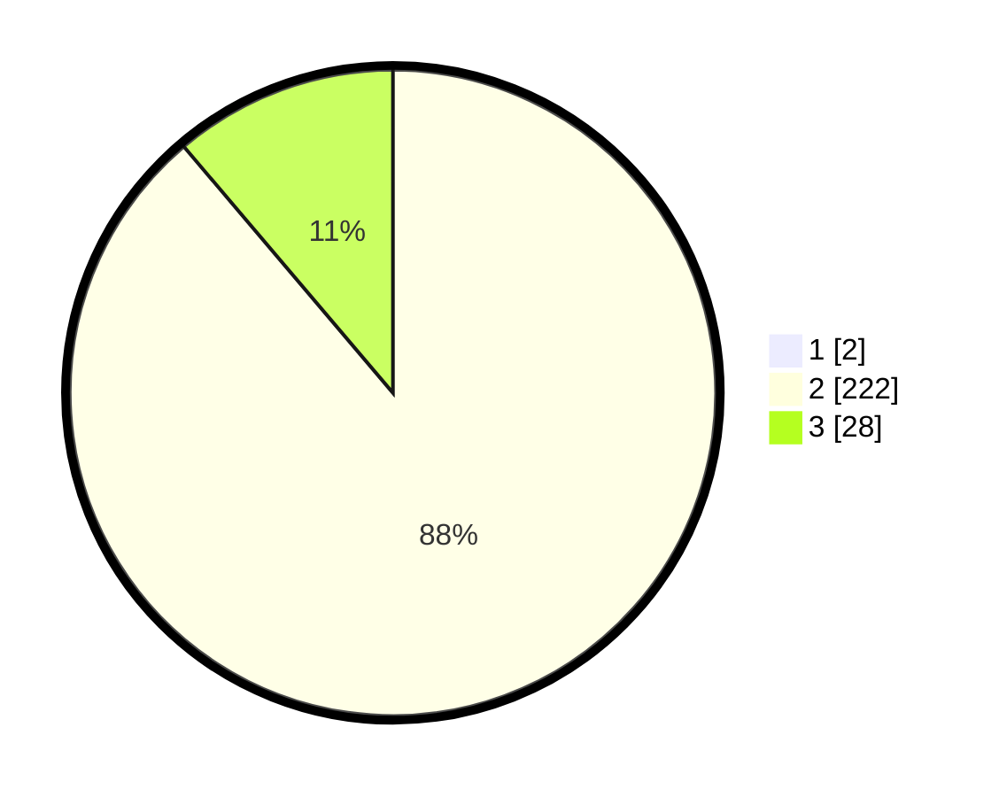

# Hasil

## Grafik

## Tabel

| No. | Nama Paslon    | Suara | Suara (raw) | Persentase |
|:--- |:-------------- | -----:| -----------:| ----------:|
| 1   | ANIES MUHAIMIN | 2     | [2][p-1]    | 0,79       |
| 2   | PRABOWO GIBRAN | 222   | [222][p-2]  | 88,10      |
| 3   | GANJAR MAHFUD  | 28    | [28][p-3]   | 11,11      |

[p-1]: https://github.com/gigit-pemilu/pemilu-2024/blob/main/pilpres/hitung-suara/sub/62-kalimantan-tengah/sub/11-pulang-pisau/sub/04-banama-tingang/sub/2003-lawang-uru/sub/002-tps/sub/paslon-1.txt
[p-2]: https://github.com/gigit-pemilu/pemilu-2024/blob/main/pilpres/hitung-suara/sub/62-kalimantan-tengah/sub/11-pulang-pisau/sub/04-banama-tingang/sub/2003-lawang-uru/sub/002-tps/sub/paslon-2.txt
[p-3]: https://github.com/gigit-pemilu/pemilu-2024/blob/main/pilpres/hitung-suara/sub/62-kalimantan-tengah/sub/11-pulang-pisau/sub/04-banama-tingang/sub/2003-lawang-uru/sub/002-tps/sub/paslon-3.txt

## Foto C Plano

https://sirekap-obj-formc.kpu.go.id/b3e9/pemilu/ppwp/62/11/04/20/03/6211042003002-20240218-103237--e39e3519-c1bf-4226-b8c8-32e889f9fa6a.jpg

https://sirekap-obj-formc.kpu.go.id/b3e9/pemilu/ppwp/62/11/04/20/03/6211042003002-20240218-103319--1d04762b-214f-4ff1-9888-5e897d3a7cd2.jpg

https://sirekap-obj-formc.kpu.go.id/b3e9/pemilu/ppwp/62/11/04/20/03/6211042003002-20240218-103455--aeaf1251-1f4c-4155-9001-a328e4f3d7fe.jpg

## Metadata

| Key        | Value               |
| ---------- | ------------------- |
| Time Stamp | 2024-02-19 06:16:00 |

