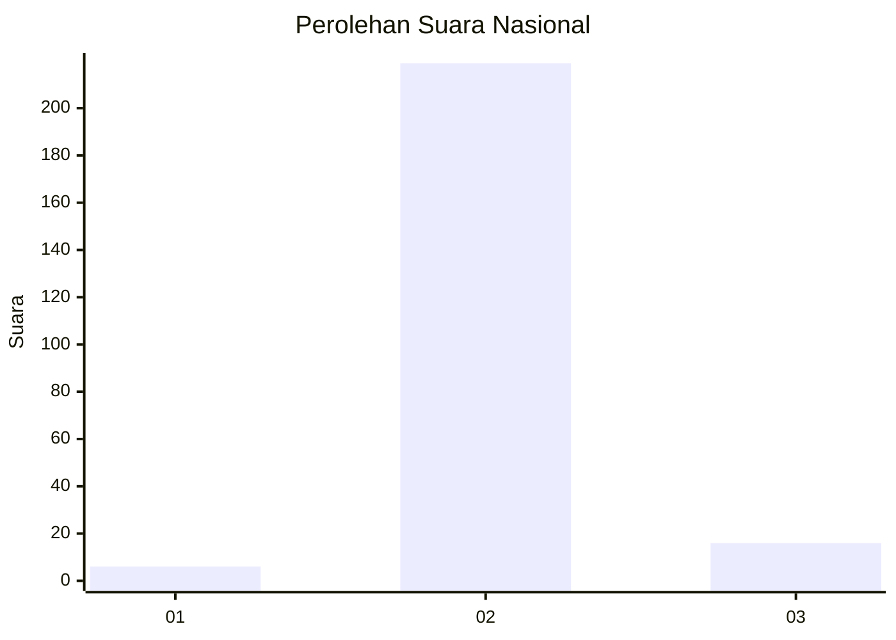
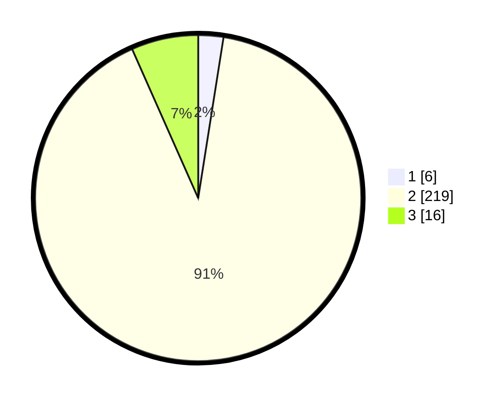

# Hasil

## Grafik

## Tabel

| No. | Nama Paslon    | Suara | Suara (raw) | Persentase |
|:--- |:-------------- | -----:| -----------:| ----------:|
| 1   | ANIES MUHAIMIN | 6     | [6][p-1]    | 2,49       |
| 2   | PRABOWO GIBRAN | 219   | [219][p-2]  | 90,87      |
| 3   | GANJAR MAHFUD  | 16    | [16][p-3]   | 6,64       |

[p-1]: https://github.com/gigit-pemilu/pemilu-2024/blob/main/pilpres/hitung-suara/sub/62-kalimantan-tengah/sub/11-pulang-pisau/sub/04-banama-tingang/sub/2003-lawang-uru/sub/003-tps/sub/paslon-1.txt
[p-2]: https://github.com/gigit-pemilu/pemilu-2024/blob/main/pilpres/hitung-suara/sub/62-kalimantan-tengah/sub/11-pulang-pisau/sub/04-banama-tingang/sub/2003-lawang-uru/sub/003-tps/sub/paslon-2.txt
[p-3]: https://github.com/gigit-pemilu/pemilu-2024/blob/main/pilpres/hitung-suara/sub/62-kalimantan-tengah/sub/11-pulang-pisau/sub/04-banama-tingang/sub/2003-lawang-uru/sub/003-tps/sub/paslon-3.txt

## Foto C Plano

https://sirekap-obj-formc.kpu.go.id/acfa/pemilu/ppwp/62/11/04/20/03/6211042003003-20240218-124254--df3916ce-b0b2-4c5c-928b-ba53e41bcab7.jpg

https://sirekap-obj-formc.kpu.go.id/acfa/pemilu/ppwp/62/11/04/20/03/6211042003003-20240218-124216--f28590bd-9ec0-4bbc-8910-1ffcd0033fff.jpg

https://sirekap-obj-formc.kpu.go.id/acfa/pemilu/ppwp/62/11/04/20/03/6211042003003-20240218-124334--bb8be686-aeed-46a3-8bcb-e973d10587e9.jpg

## Metadata

| Key        | Value               |
| ---------- | ------------------- |
| Time Stamp | 2024-02-19 06:16:00 |

