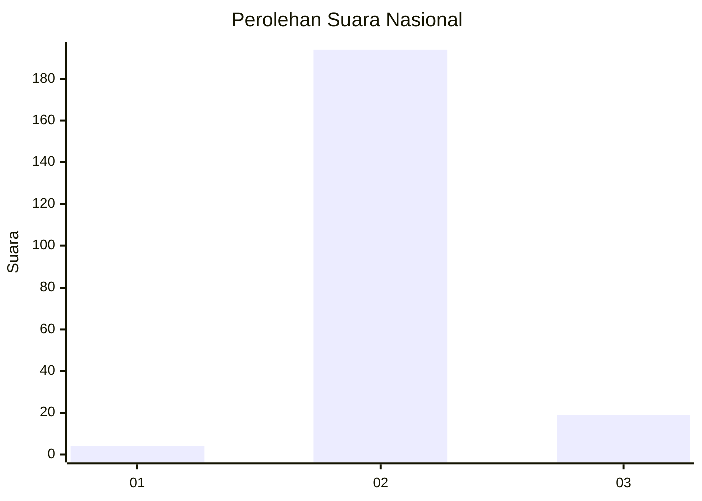
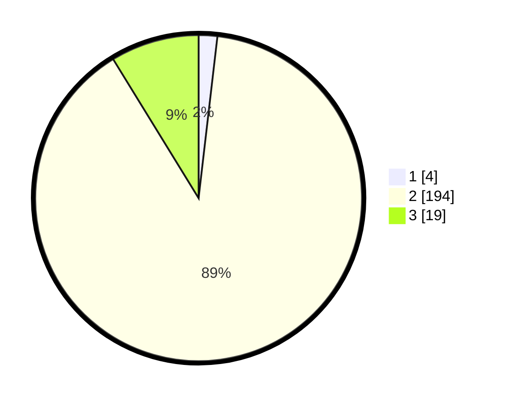

# Hasil

## Grafik

## Tabel

| No. | Nama Paslon    | Suara | Suara (raw) | Persentase |
|:--- |:-------------- | -----:| -----------:| ----------:|
| 1   | ANIES MUHAIMIN | 4     | [4][p-1]    | 1,84       |
| 2   | PRABOWO GIBRAN | 194   | [194][p-2]  | 89,40      |
| 3   | GANJAR MAHFUD  | 19    | [19][p-3]   | 8,76       |

[p-1]: https://github.com/gigit-pemilu/pemilu-2024/blob/main/pilpres/hitung-suara/sub/62-kalimantan-tengah/sub/11-pulang-pisau/sub/04-banama-tingang/sub/2006-ramang/sub/002-tps/sub/paslon-1.txt
[p-2]: https://github.com/gigit-pemilu/pemilu-2024/blob/main/pilpres/hitung-suara/sub/62-kalimantan-tengah/sub/11-pulang-pisau/sub/04-banama-tingang/sub/2006-ramang/sub/002-tps/sub/paslon-2.txt
[p-3]: https://github.com/gigit-pemilu/pemilu-2024/blob/main/pilpres/hitung-suara/sub/62-kalimantan-tengah/sub/11-pulang-pisau/sub/04-banama-tingang/sub/2006-ramang/sub/002-tps/sub/paslon-3.txt

## Foto C Plano

https://sirekap-obj-formc.kpu.go.id/e8b5/pemilu/ppwp/62/11/04/20/06/6211042006002-20240218-194133--1b0eefa1-44d2-4e80-b926-81d75fc94f70.jpg

https://sirekap-obj-formc.kpu.go.id/e8b5/pemilu/ppwp/62/11/04/20/06/6211042006002-20240218-194223--b594bc2e-7941-4327-b7d6-5ca7a18daa92.jpg

https://sirekap-obj-formc.kpu.go.id/e8b5/pemilu/ppwp/62/11/04/20/06/6211042006002-20240218-194259--03beb4b1-ecab-40d6-9ed2-73424eca826f.jpg

## Metadata

| Key        | Value               |
| ---------- | ------------------- |
| Time Stamp | 2024-02-19 10:00:00 |

