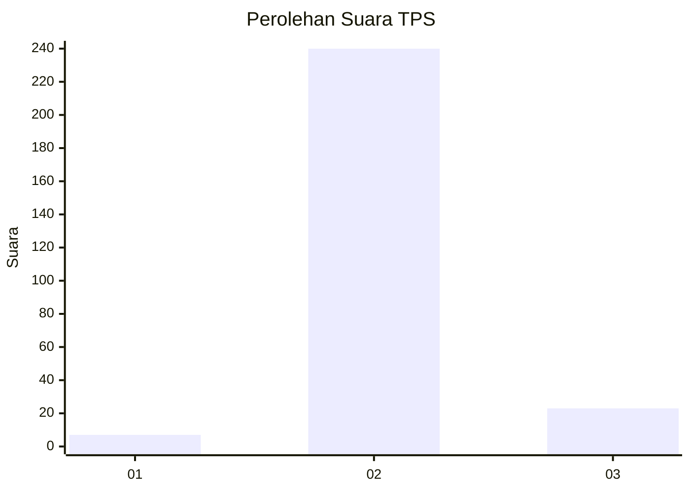
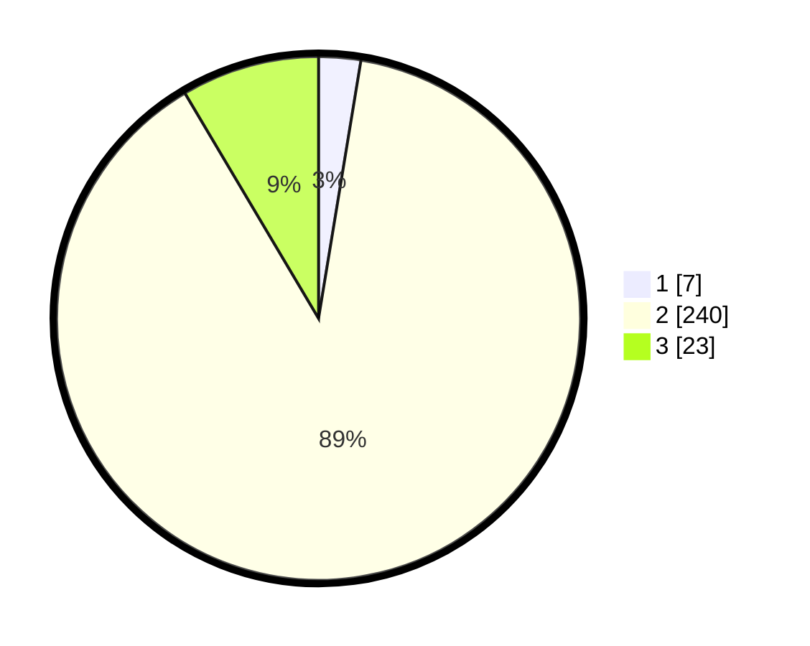

# Hasil

## Grafik

## Tabel

| No. | Nama Paslon    | Suara | Suara (raw) | Persentase |
|:--- |:-------------- | -----:| -----------:| ----------:|
| 1   | ANIES MUHAIMIN | 7     | [7][p-1]    | 2,59       |
| 2   | PRABOWO GIBRAN | 240   | [240][p-2]  | 88,89      |
| 3   | GANJAR MAHFUD  | 23    | [23][p-3]   | 8,52       |

[p-1]: https://github.com/gigit-pemilu/pemilu-2024-62-kalimantan-tengah/blob/main/pilpres/hitung-suara/sub/62-kalimantan-tengah/sub/11-pulang-pisau/sub/04-banama-tingang/sub/2009-goha/sub/002-tps/sub/paslon-1.txt
[p-2]: https://github.com/gigit-pemilu/pemilu-2024-62-kalimantan-tengah/blob/main/pilpres/hitung-suara/sub/62-kalimantan-tengah/sub/11-pulang-pisau/sub/04-banama-tingang/sub/2009-goha/sub/002-tps/sub/paslon-2.txt
[p-3]: https://github.com/gigit-pemilu/pemilu-2024-62-kalimantan-tengah/blob/main/pilpres/hitung-suara/sub/62-kalimantan-tengah/sub/11-pulang-pisau/sub/04-banama-tingang/sub/2009-goha/sub/002-tps/sub/paslon-3.txt

## Foto C Plano

https://sirekap-obj-formc.kpu.go.id/7058/pemilu/ppwp/62/11/04/20/09/6211042009002-20240219-101009--06229c3b-1717-48ca-9b6c-cf92550b864e.jpg

https://sirekap-obj-formc.kpu.go.id/7058/pemilu/ppwp/62/11/04/20/09/6211042009002-20240219-101030--3ddc4bf8-f26b-4342-862f-94df08760c36.jpg

https://sirekap-obj-formc.kpu.go.id/7058/pemilu/ppwp/62/11/04/20/09/6211042009002-20240219-101051--c440d4f4-e392-44ef-9080-3f97d3c41217.jpg

## Metadata

| Key        | Value               |
| ---------- | ------------------- |
| Time Stamp | 2024-02-19 20:00:00 |

