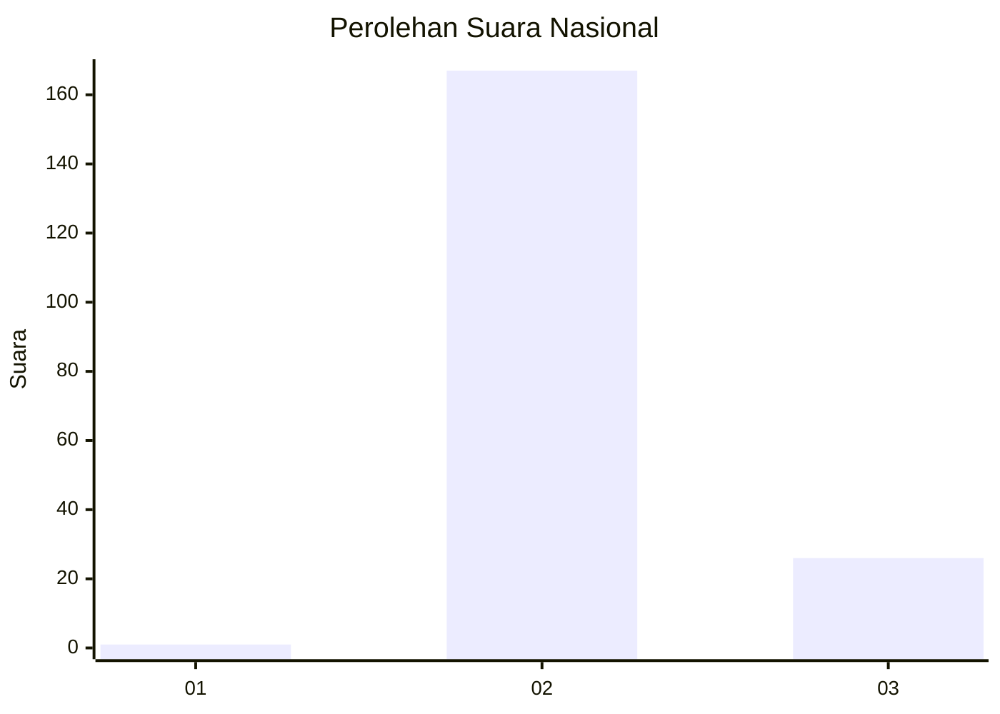
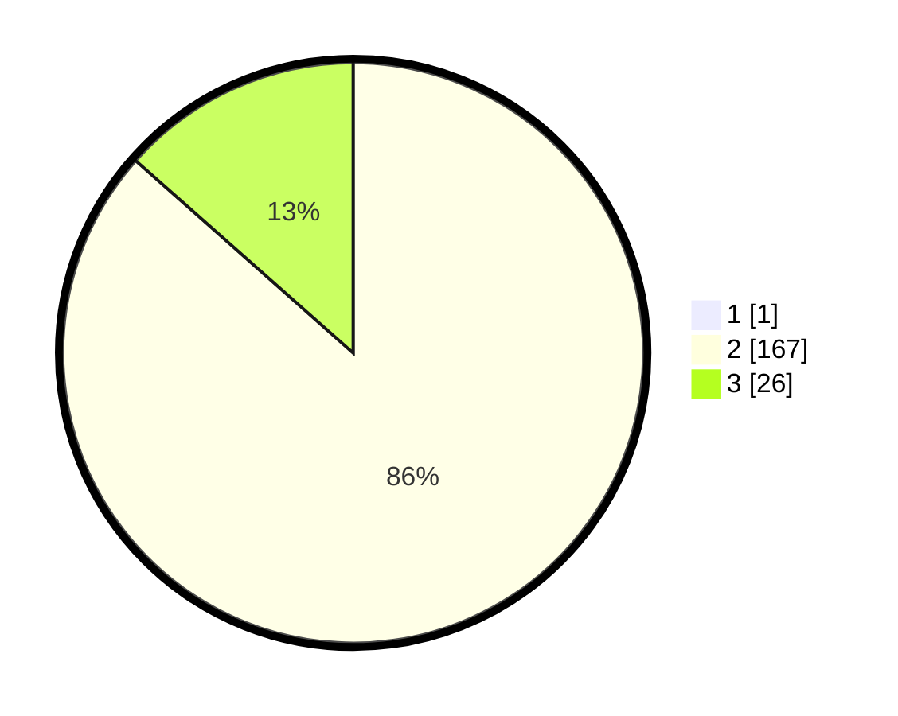

# Hasil

## Grafik

## Tabel

| No. | Nama Paslon    | Suara | Suara (raw) | Persentase |
|:--- |:-------------- | -----:| -----------:| ----------:|
| 1   | ANIES MUHAIMIN | 1     | [1][p-1]    | 0,52       |
| 2   | PRABOWO GIBRAN | 167   | [167][p-2]  | 86,08      |
| 3   | GANJAR MAHFUD  | 26    | [26][p-3]   | 13,40      |

[p-1]: https://github.com/gigit-pemilu/pemilu-2024/blob/main/pilpres/hitung-suara/sub/62-kalimantan-tengah/sub/11-pulang-pisau/sub/04-banama-tingang/sub/2011-tumbang-tarusan/sub/001-tps/sub/paslon-1.txt
[p-2]: https://github.com/gigit-pemilu/pemilu-2024/blob/main/pilpres/hitung-suara/sub/62-kalimantan-tengah/sub/11-pulang-pisau/sub/04-banama-tingang/sub/2011-tumbang-tarusan/sub/001-tps/sub/paslon-2.txt
[p-3]: https://github.com/gigit-pemilu/pemilu-2024/blob/main/pilpres/hitung-suara/sub/62-kalimantan-tengah/sub/11-pulang-pisau/sub/04-banama-tingang/sub/2011-tumbang-tarusan/sub/001-tps/sub/paslon-3.txt

## Foto C Plano

https://sirekap-obj-formc.kpu.go.id/3fc8/pemilu/ppwp/62/11/04/20/11/6211042011001-20240217-201453--e66594e0-90d0-4a90-984e-d2c1d14a4551.jpg

https://sirekap-obj-formc.kpu.go.id/3fc8/pemilu/ppwp/62/11/04/20/11/6211042011001-20240217-201533--423f4292-38ac-48e5-b758-bad478dd5170.jpg

https://sirekap-obj-formc.kpu.go.id/3fc8/pemilu/ppwp/62/11/04/20/11/6211042011001-20240217-201622--bf4869c4-e14c-4bff-8233-18d61bc125df.jpg

## Metadata

| Key        | Value               |
| ---------- | ------------------- |
| Time Stamp | 2024-02-19 06:16:00 |

