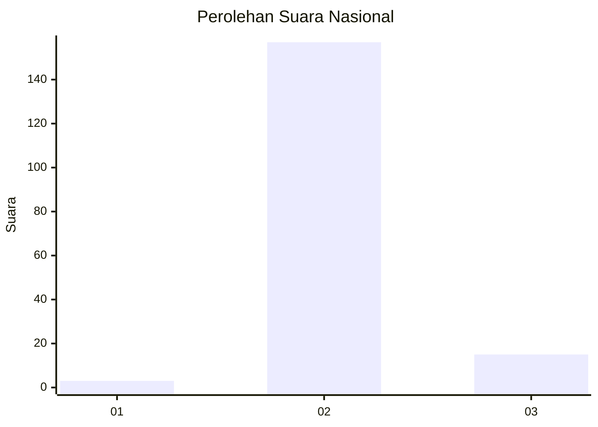
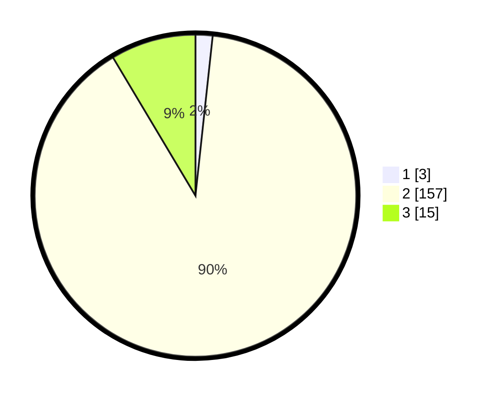

# Hasil

## Grafik

## Tabel

| No. | Nama Paslon    | Suara | Suara (raw) | Persentase |
|:--- |:-------------- | -----:| -----------:| ----------:|
| 1   | ANIES MUHAIMIN | 3     | [3][p-1]    | 1,71       |
| 2   | PRABOWO GIBRAN | 157   | [157][p-2]  | 89,71      |
| 3   | GANJAR MAHFUD  | 15    | [15][p-3]   | 8,57       |

[p-1]: https://github.com/gigit-pemilu/pemilu-2024/blob/main/pilpres/hitung-suara/sub/62-kalimantan-tengah/sub/11-pulang-pisau/sub/04-banama-tingang/sub/2013-pangi/sub/002-tps/sub/paslon-1.txt
[p-2]: https://github.com/gigit-pemilu/pemilu-2024/blob/main/pilpres/hitung-suara/sub/62-kalimantan-tengah/sub/11-pulang-pisau/sub/04-banama-tingang/sub/2013-pangi/sub/002-tps/sub/paslon-2.txt
[p-3]: https://github.com/gigit-pemilu/pemilu-2024/blob/main/pilpres/hitung-suara/sub/62-kalimantan-tengah/sub/11-pulang-pisau/sub/04-banama-tingang/sub/2013-pangi/sub/002-tps/sub/paslon-3.txt

## Foto C Plano

https://sirekap-obj-formc.kpu.go.id/acc5/pemilu/ppwp/62/11/04/20/13/6211042013002-20240217-143645--50ea424e-1508-40cb-8fae-b7bbbe2c5c1b.jpg

https://sirekap-obj-formc.kpu.go.id/acc5/pemilu/ppwp/62/11/04/20/13/6211042013002-20240217-143732--748c2f35-c0ff-4a15-871b-f6316cc56627.jpg

https://sirekap-obj-formc.kpu.go.id/acc5/pemilu/ppwp/62/11/04/20/13/6211042013002-20240217-143805--1c143b14-9551-4295-a367-fb58bba11021.jpg

## Metadata

| Key        | Value               |
| ---------- | ------------------- |
| Time Stamp | 2024-02-17 16:36:25 |

