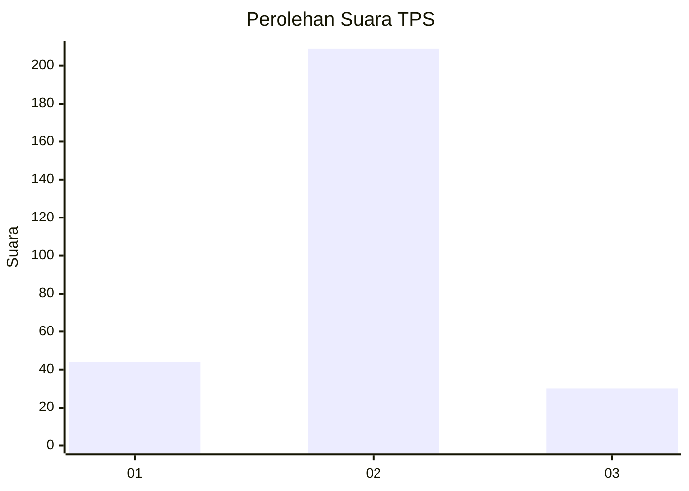
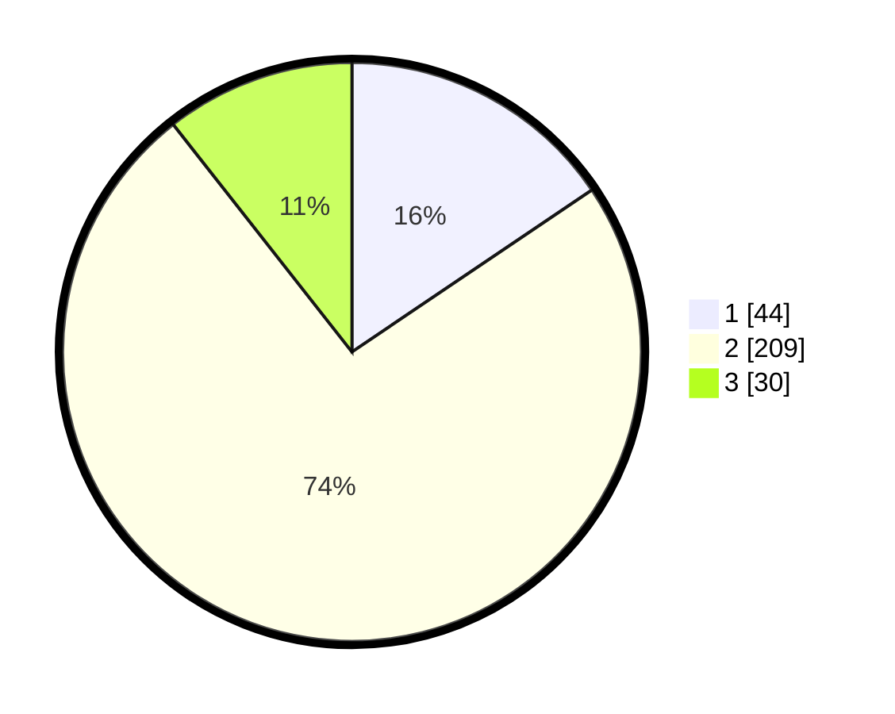

# Hasil

## Grafik

## Tabel

| No. | Nama Paslon    | Suara | Suara (raw) | Persentase |
|:--- |:-------------- | -----:| -----------:| ----------:|
| 1   | ANIES MUHAIMIN | 44    | [44][p-1]   | 15,55      |
| 2   | PRABOWO GIBRAN | 209   | [209][p-2]  | 73,85      |
| 3   | GANJAR MAHFUD  | 30    | [30][p-3]   | 10,60      |

[p-1]: https://github.com/gigit-pemilu/pemilu-2024-62-kalimantan-tengah/blob/main/pilpres/hitung-suara/sub/62-kalimantan-tengah/sub/11-pulang-pisau/sub/05-kahayan-hilir/sub/1005-pulang-pisau/sub/003-tps/sub/paslon-1.txt
[p-2]: https://github.com/gigit-pemilu/pemilu-2024-62-kalimantan-tengah/blob/main/pilpres/hitung-suara/sub/62-kalimantan-tengah/sub/11-pulang-pisau/sub/05-kahayan-hilir/sub/1005-pulang-pisau/sub/003-tps/sub/paslon-2.txt
[p-3]: https://github.com/gigit-pemilu/pemilu-2024-62-kalimantan-tengah/blob/main/pilpres/hitung-suara/sub/62-kalimantan-tengah/sub/11-pulang-pisau/sub/05-kahayan-hilir/sub/1005-pulang-pisau/sub/003-tps/sub/paslon-3.txt

## Foto C Plano

https://sirekap-obj-formc.kpu.go.id/5ac0/pemilu/ppwp/62/11/05/10/05/6211051005003-20240217-163317--240364d1-12ad-44aa-a133-4aedc2ddfd44.jpg

https://sirekap-obj-formc.kpu.go.id/5ac0/pemilu/ppwp/62/11/05/10/05/6211051005003-20240217-163621--ec07b6fd-9070-4af8-b143-e7992dbeaef1.jpg

https://sirekap-obj-formc.kpu.go.id/5ac0/pemilu/ppwp/62/11/05/10/05/6211051005003-20240217-163818--82bbaedd-4336-4cc2-bd85-17e521cd0095.jpg

## Metadata

| Key        | Value               |
| ---------- | ------------------- |
| Time Stamp | 2024-02-19 06:16:00 |

## DATA PEMILIH TETAP

Jumlah pemilih dalam DPT: **295**.
 * L: **142**.
 * P: **153**.

## DATA PENGGUNA HAK PILIH

Jumlah pengguna hak pilih dalam DPT: **262**.
 * L: **123**.
 * P: **139**.

Jumlah pengguna hak pilih dalam DPTb: **10**.
 * L: **5**.
 * P: **5**.

Jumlah pengguna hak pilih dalam DPK: **16**.
 * L: **8**.
 * P: **8**.

Jumlah pengguna hak pilih: **288**.
 * L: **136**.
 * P: **152**.

## JUMLAH SUARA SAH DAN TIDAK SAH

JUMLAH SELURUH SUARA SAH: **283**.

JUMLAH SUARA TIDAK SAH: **5**.

JUMLAH SELURUH SUARA SAH DAN SUARA TIDAK SAH: **288**.

