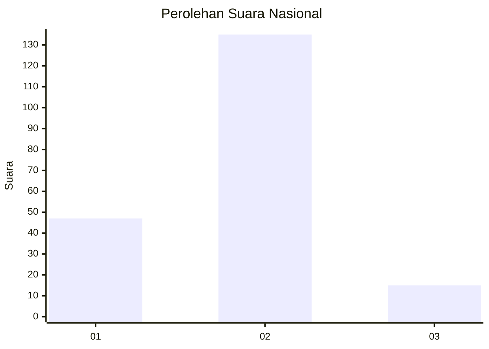
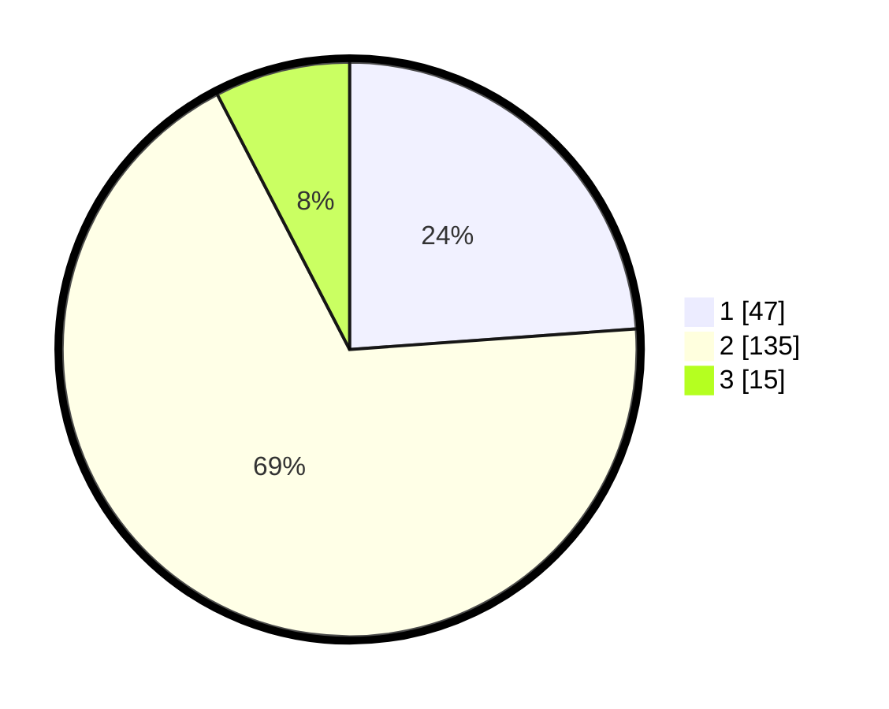

# Hasil

## Grafik

## Tabel

| No. | Nama Paslon    | Suara | Suara (raw) | Persentase |
|:--- |:-------------- | -----:| -----------:| ----------:|
| 1   | ANIES MUHAIMIN | 47    | [47][p-1]   | 23,86      |
| 2   | PRABOWO GIBRAN | 135   | [135][p-2]  | 68,53      |
| 3   | GANJAR MAHFUD  | 15    | [15][p-3]   | 7,61       |

[p-1]: https://github.com/gigit-pemilu/pemilu-2024/blob/main/pilpres/hitung-suara/sub/62-kalimantan-tengah/sub/11-pulang-pisau/sub/05-kahayan-hilir/sub/1005-pulang-pisau/sub/004-tps/sub/paslon-1.txt
[p-2]: https://github.com/gigit-pemilu/pemilu-2024/blob/main/pilpres/hitung-suara/sub/62-kalimantan-tengah/sub/11-pulang-pisau/sub/05-kahayan-hilir/sub/1005-pulang-pisau/sub/004-tps/sub/paslon-2.txt
[p-3]: https://github.com/gigit-pemilu/pemilu-2024/blob/main/pilpres/hitung-suara/sub/62-kalimantan-tengah/sub/11-pulang-pisau/sub/05-kahayan-hilir/sub/1005-pulang-pisau/sub/004-tps/sub/paslon-3.txt

## Foto C Plano

https://sirekap-obj-formc.kpu.go.id/2837/pemilu/ppwp/62/11/05/10/05/6211051005004-20240217-213235--ff1b4e54-da4d-45b9-96e4-eb2e5cc03000.jpg

https://sirekap-obj-formc.kpu.go.id/2837/pemilu/ppwp/62/11/05/10/05/6211051005004-20240217-213326--9032f9a8-1dee-4087-8546-c95d7bd2a252.jpg

https://sirekap-obj-formc.kpu.go.id/2837/pemilu/ppwp/62/11/05/10/05/6211051005004-20240217-213401--0b6d8b48-1ef2-478f-91e3-7284ccc8d81f.jpg

## Metadata

| Key        | Value               |
| ---------- | ------------------- |
| Time Stamp | 2024-02-19 06:16:00 |

