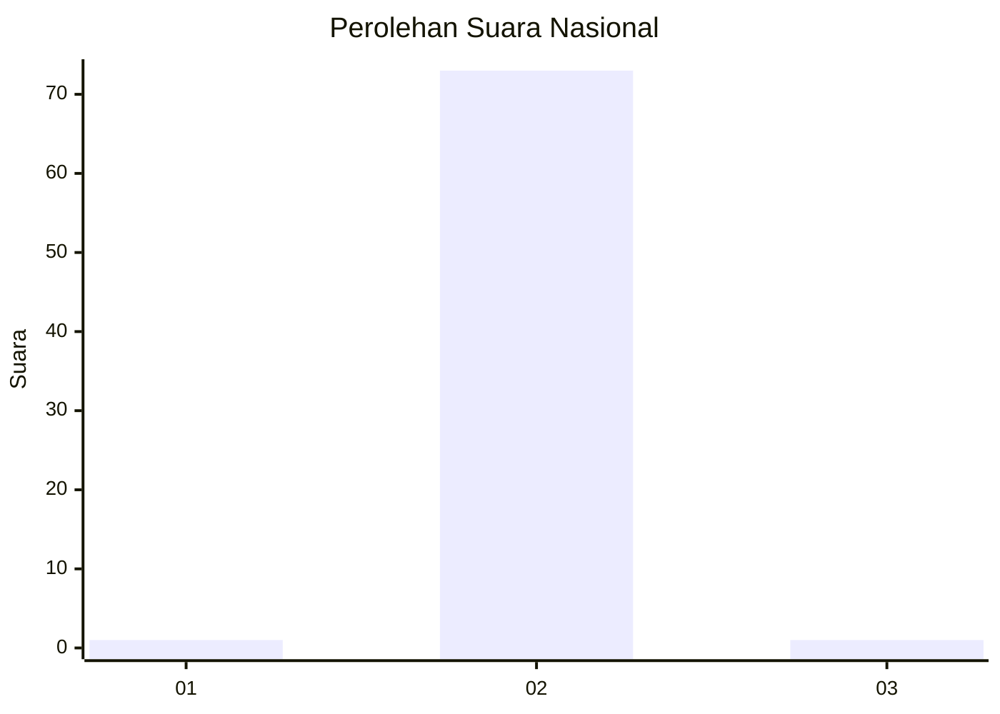
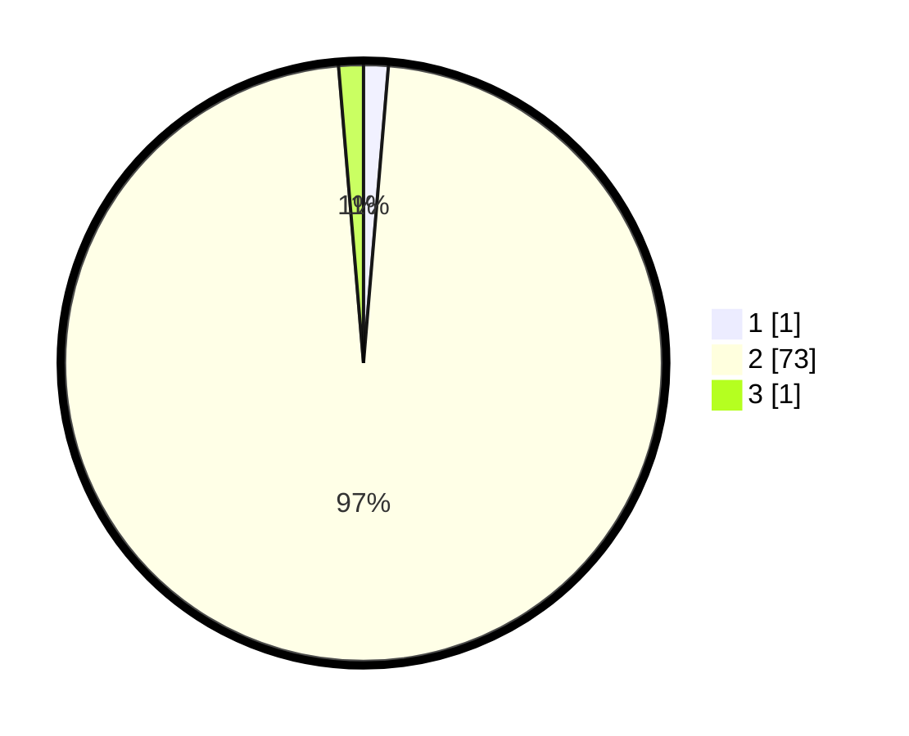

# Hasil

## Grafik

## Tabel

| No. | Nama Paslon    | Suara | Suara (raw) | Persentase |
|:--- |:-------------- | -----:| -----------:| ----------:|
| 1   | ANIES MUHAIMIN | 1     | [1][p-1]    | 1,33       |
| 2   | PRABOWO GIBRAN | 73    | [73][p-2]   | 97,33      |
| 3   | GANJAR MAHFUD  | 1     | [1][p-3]    | 1,33       |

[p-1]: https://github.com/gigit-pemilu/pemilu-2024/blob/main/pilpres/hitung-suara/sub/62-kalimantan-tengah/sub/11-pulang-pisau/sub/08-sebangau-kuala/sub/2001-paduran-sebangau/sub/004-tps/sub/paslon-1.txt
[p-2]: https://github.com/gigit-pemilu/pemilu-2024/blob/main/pilpres/hitung-suara/sub/62-kalimantan-tengah/sub/11-pulang-pisau/sub/08-sebangau-kuala/sub/2001-paduran-sebangau/sub/004-tps/sub/paslon-2.txt
[p-3]: https://github.com/gigit-pemilu/pemilu-2024/blob/main/pilpres/hitung-suara/sub/62-kalimantan-tengah/sub/11-pulang-pisau/sub/08-sebangau-kuala/sub/2001-paduran-sebangau/sub/004-tps/sub/paslon-3.txt

## Foto C Plano

https://sirekap-obj-formc.kpu.go.id/9d6e/pemilu/ppwp/62/11/08/20/01/6211082001004-20240216-152748--5061802b-7a20-4877-9e1e-3440916d5f8a.jpg

https://sirekap-obj-formc.kpu.go.id/9d6e/pemilu/ppwp/62/11/08/20/01/6211082001004-20240216-105242--30559f3e-62d7-4d20-b4ef-1a29a8eb35e4.jpg

https://sirekap-obj-formc.kpu.go.id/9d6e/pemilu/ppwp/62/11/08/20/01/6211082001004-20240216-105233--588901c9-4f86-4797-a3b1-8aa8adcecab1.jpg

## Metadata

| Key        | Value               |
| ---------- | ------------------- |
| Time Stamp | 2024-02-17 16:00:02 |

## DATA PEMILIH TETAP

Jumlah pemilih dalam DPT: **87**.
 * L: **50**.
 * P: **37**.

## DATA PENGGUNA HAK PILIH

Jumlah pengguna hak pilih dalam DPT: **66**.
 * L: **37**.
 * P: **29**.

Jumlah pengguna hak pilih dalam DPTb: **4**.
 * L: **4**.
 * P: **0**.

Jumlah pengguna hak pilih dalam DPK: **5**.
 * L: **4**.
 * P: **1**.

Jumlah pengguna hak pilih: **75**.
 * L: **45**.
 * P: **30**.

## JUMLAH SUARA SAH DAN TIDAK SAH

JUMLAH SELURUH SUARA SAH: **75**.

JUMLAH SUARA TIDAK SAH: **0**.

JUMLAH SELURUH SUARA SAH DAN SUARA TIDAK SAH: **75**.

