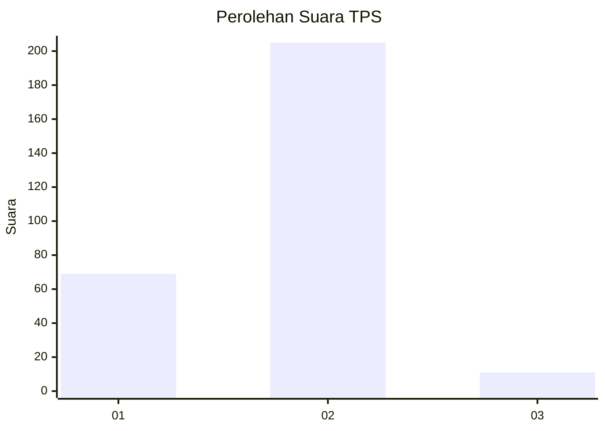

# Hasil

## Grafik

## Tabel

| No. | Nama Paslon    | Suara | Suara (raw) | Persentase |
|:--- |:-------------- | -----:| -----------:| ----------:|
| 1   | ANIES MUHAIMIN | 69    | [69][p-1]   | 24,21      |
| 2   | PRABOWO GIBRAN | 205   | [205][p-2]  | 71,93      |
| 3   | GANJAR MAHFUD  | 11    | [11][p-3]   | 3,86       |

[p-1]: https://github.com/gigit-pemilu/pemilu-2024-62-kalimantan-tengah/blob/main/pilpres/hitung-suara/sub/62-kalimantan-tengah/sub/12-murung-raya/sub/01-murung/sub/2008-bahitom/sub/003-tps/sub/paslon-1.txt
[p-2]: https://github.com/gigit-pemilu/pemilu-2024-62-kalimantan-tengah/blob/main/pilpres/hitung-suara/sub/62-kalimantan-tengah/sub/12-murung-raya/sub/01-murung/sub/2008-bahitom/sub/003-tps/sub/paslon-2.txt
[p-3]: https://github.com/gigit-pemilu/pemilu-2024-62-kalimantan-tengah/blob/main/pilpres/hitung-suara/sub/62-kalimantan-tengah/sub/12-murung-raya/sub/01-murung/sub/2008-bahitom/sub/003-tps/sub/paslon-3.txt

## Foto C Plano

https://sirekap-obj-formc.kpu.go.id/fec9/pemilu/ppwp/62/12/01/20/08/6212012008003-20240217-095434--33c61a50-16e8-40bf-a61a-62e9c91438ed.jpg

https://sirekap-obj-formc.kpu.go.id/fec9/pemilu/ppwp/62/12/01/20/08/6212012008003-20240217-095435--838473a1-021a-429d-a230-75d4b6a2f673.jpg

https://sirekap-obj-formc.kpu.go.id/fec9/pemilu/ppwp/62/12/01/20/08/6212012008003-20240217-095435--7da899f6-e6a1-4641-9af9-422d85a42e09.jpg

## Metadata

| Key        | Value               |
| ---------- | ------------------- |
| Time Stamp | 2024-02-17 10:00:02 |

## DATA PEMILIH TETAP

Jumlah pemilih dalam DPT: **289**.
 * L: **137**.
 * P: **152**.

## DATA PENGGUNA HAK PILIH

Jumlah pengguna hak pilih dalam DPT: **260**.
 * L: **122**.
 * P: **138**.

Jumlah pengguna hak pilih dalam DPTb: **2**.
 * L: **1**.
 * P: **1**.

Jumlah pengguna hak pilih dalam DPK: **32**.
 * L: **21**.
 * P: **11**.

Jumlah pengguna hak pilih: **294**.
 * L: **144**.
 * P: **150**.

## JUMLAH SUARA SAH DAN TIDAK SAH

JUMLAH SELURUH SUARA SAH: **285**.

JUMLAH SUARA TIDAK SAH: **9**.

JUMLAH SELURUH SUARA SAH DAN SUARA TIDAK SAH: **294**.

