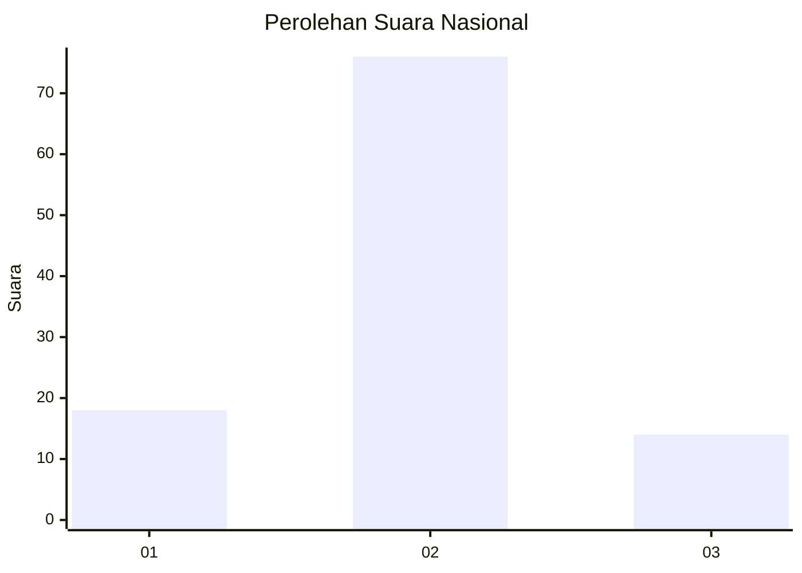
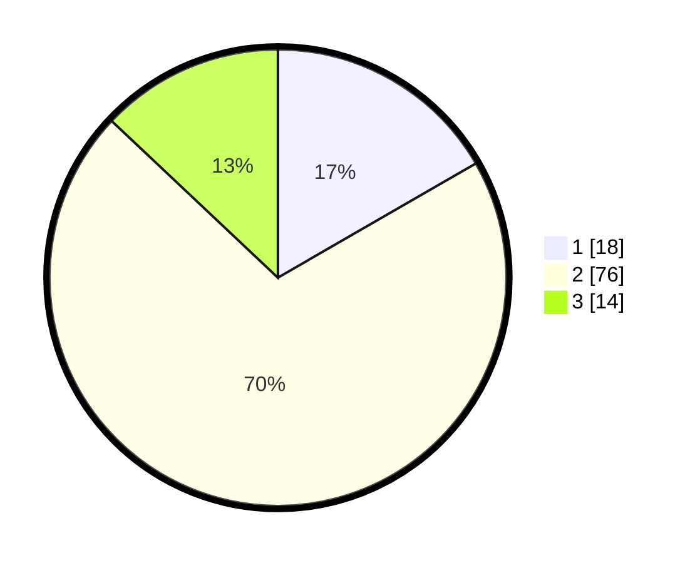

# Hasil

## Grafik

## Tabel

| No. | Nama Paslon    | Suara | Suara (raw) | Persentase |
|:--- |:-------------- | -----:| -----------:| ----------:|
| 1   | ANIES MUHAIMIN | 18    | [18][p-1]   | 16,67      |
| 2   | PRABOWO GIBRAN | 76    | [76][p-2]   | 70,37      |
| 3   | GANJAR MAHFUD  | 14    | [14][p-3]   | 12,96      |

[p-1]: https://github.com/gigit-pemilu/pemilu-2024/blob/main/pilpres/hitung-suara/sub/62-kalimantan-tengah/sub/12-murung-raya/sub/02-tanah-siang/sub/2020-dirung-bakung/sub/003-tps/sub/paslon-1.txt
[p-2]: https://github.com/gigit-pemilu/pemilu-2024/blob/main/pilpres/hitung-suara/sub/62-kalimantan-tengah/sub/12-murung-raya/sub/02-tanah-siang/sub/2020-dirung-bakung/sub/003-tps/sub/paslon-2.txt
[p-3]: https://github.com/gigit-pemilu/pemilu-2024/blob/main/pilpres/hitung-suara/sub/62-kalimantan-tengah/sub/12-murung-raya/sub/02-tanah-siang/sub/2020-dirung-bakung/sub/003-tps/sub/paslon-3.txt

## Foto C Plano

https://sirekap-obj-formc.kpu.go.id/066c/pemilu/ppwp/62/12/02/20/20/6212022020003-20240215-105314--ad419c2f-e89a-48bd-a65e-f40b96d51c24.jpg

https://sirekap-obj-formc.kpu.go.id/066c/pemilu/ppwp/62/12/02/20/20/6212022020003-20240215-105453--fdda9846-5ae9-42f0-94a4-9b8c0fcc008c.jpg

https://sirekap-obj-formc.kpu.go.id/066c/pemilu/ppwp/62/12/02/20/20/6212022020003-20240215-110858--e4fa5748-91ae-4560-af11-44fcd10622b4.jpg

## Metadata

| Key        | Value               |
| ---------- | ------------------- |
| Time Stamp | 2024-02-15 15:30:25 |

## DATA PEMILIH TETAP

Jumlah pemilih dalam DPT: **131**.
 * L: **74**.
 * P: **57**.

## DATA PENGGUNA HAK PILIH

Jumlah pengguna hak pilih dalam DPT: **79**.
 * L: **53**.
 * P: **26**.

Jumlah pengguna hak pilih dalam DPTb: **0**.
 * L: **0**.
 * P: **0**.

Jumlah pengguna hak pilih dalam DPK: **39**.
 * L: **22**.
 * P: **17**.

Jumlah pengguna hak pilih: **118**.
 * L: **75**.
 * P: **43**.

## JUMLAH SUARA SAH DAN TIDAK SAH

JUMLAH SELURUH SUARA SAH: **108**.

JUMLAH SUARA TIDAK SAH: **10**.

JUMLAH SELURUH SUARA SAH DAN SUARA TIDAK SAH: **118**.

