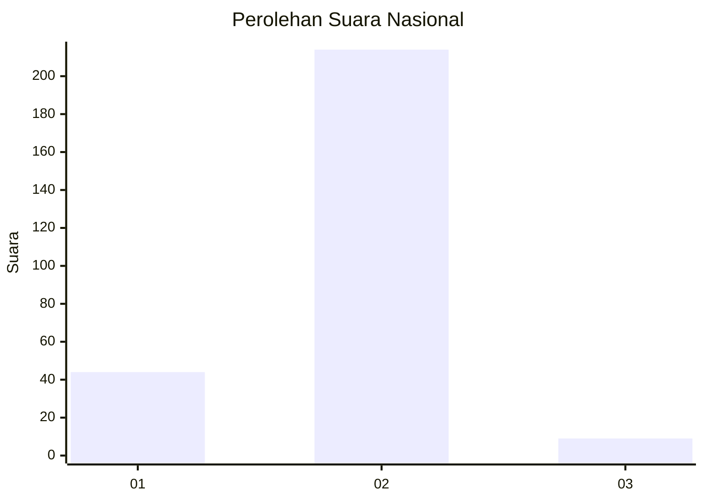
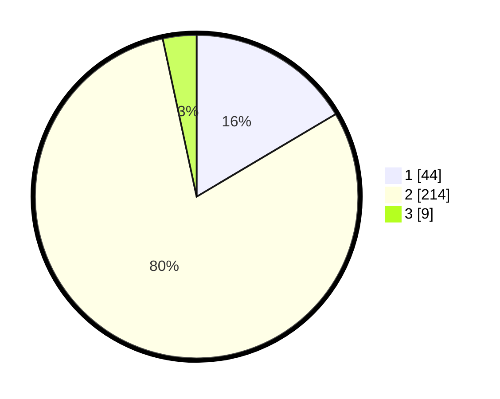

# Hasil

## Grafik

## Tabel

| No. | Nama Paslon    | Suara | Suara (raw) | Persentase |
|:--- |:-------------- | -----:| -----------:| ----------:|
| 1   | ANIES MUHAIMIN | 44    | [44][p-1]   | 16,48      |
| 2   | PRABOWO GIBRAN | 214   | [214][p-2]  | 80,15      |
| 3   | GANJAR MAHFUD  | 9     | [9][p-3]    | 3,37       |

[p-1]: https://github.com/gigit-pemilu/pemilu-2024/blob/main/pilpres/hitung-suara/sub/62-kalimantan-tengah/sub/12-murung-raya/sub/05-sumber-barito/sub/2002-tumbang-masao/sub/004-tps/sub/paslon-1.txt
[p-2]: https://github.com/gigit-pemilu/pemilu-2024/blob/main/pilpres/hitung-suara/sub/62-kalimantan-tengah/sub/12-murung-raya/sub/05-sumber-barito/sub/2002-tumbang-masao/sub/004-tps/sub/paslon-2.txt
[p-3]: https://github.com/gigit-pemilu/pemilu-2024/blob/main/pilpres/hitung-suara/sub/62-kalimantan-tengah/sub/12-murung-raya/sub/05-sumber-barito/sub/2002-tumbang-masao/sub/004-tps/sub/paslon-3.txt

## Foto C Plano

https://sirekap-obj-formc.kpu.go.id/6fa2/pemilu/ppwp/62/12/05/20/02/6212052002004-20240215-152551--3e777d12-d959-47a7-83dd-0dfbaf0ed666.jpg

https://sirekap-obj-formc.kpu.go.id/6fa2/pemilu/ppwp/62/12/05/20/02/6212052002004-20240215-152700--90af2140-adeb-41e8-b31c-ed4611b64e1d.jpg

https://sirekap-obj-formc.kpu.go.id/6fa2/pemilu/ppwp/62/12/05/20/02/6212052002004-20240215-152916--9d789712-1f83-4a6a-b067-839ebab6fda2.jpg

## Metadata

| Key        | Value               |
| ---------- | ------------------- |
| Time Stamp | 2024-02-15 18:30:25 |

