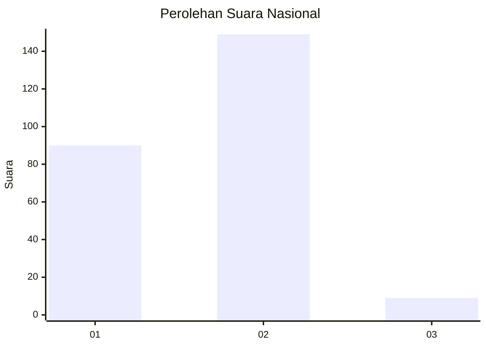
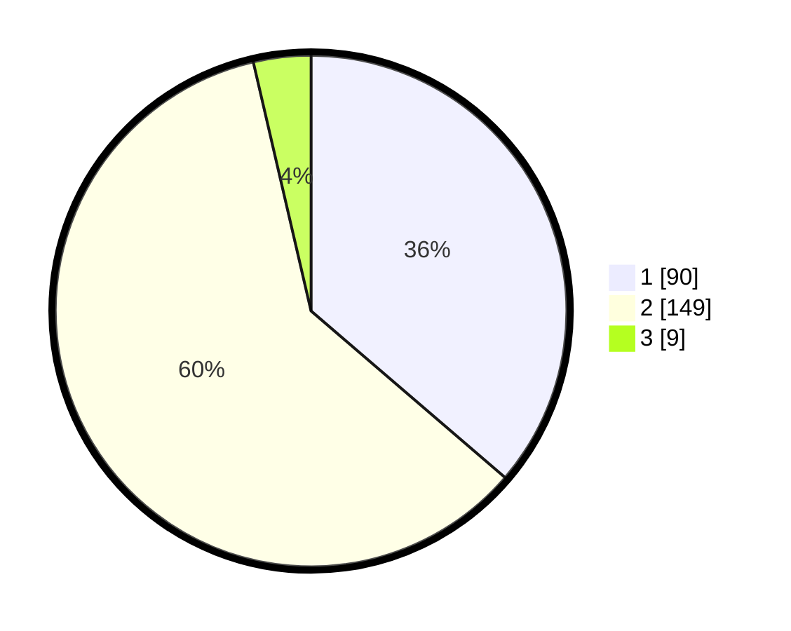

# Hasil

## Grafik

## Tabel

| No. | Nama Paslon    | Suara | Suara (raw) | Persentase |
|:--- |:-------------- | -----:| -----------:| ----------:|
| 1   | ANIES MUHAIMIN | 90    | [90][p-1]   | 36,29      |
| 2   | PRABOWO GIBRAN | 149   | [149][p-2]  | 60,08      |
| 3   | GANJAR MAHFUD  | 9     | [9][p-3]    | 3,63       |

[p-1]: https://github.com/gigit-pemilu/pemilu-2024/blob/main/pilpres/hitung-suara/sub/62-kalimantan-tengah/sub/13-barito-timur/sub/01-dusun-timur/sub/1012-tamiang-layang/sub/005-tps/sub/paslon-1.txt
[p-2]: https://github.com/gigit-pemilu/pemilu-2024/blob/main/pilpres/hitung-suara/sub/62-kalimantan-tengah/sub/13-barito-timur/sub/01-dusun-timur/sub/1012-tamiang-layang/sub/005-tps/sub/paslon-2.txt
[p-3]: https://github.com/gigit-pemilu/pemilu-2024/blob/main/pilpres/hitung-suara/sub/62-kalimantan-tengah/sub/13-barito-timur/sub/01-dusun-timur/sub/1012-tamiang-layang/sub/005-tps/sub/paslon-3.txt

## Foto C Plano

https://sirekap-obj-formc.kpu.go.id/8988/pemilu/ppwp/62/13/01/10/12/6213011012005-20240217-061713--dd2eeef8-36d0-4433-9e25-ed42e988c117.jpg

https://sirekap-obj-formc.kpu.go.id/8988/pemilu/ppwp/62/13/01/10/12/6213011012005-20240217-064650--384b0dd1-b392-4c68-ac99-0f866b555d9f.jpg

## Metadata

| Key        | Value               |
| ---------- | ------------------- |
| Time Stamp | 2024-02-19 19:00:00 |

