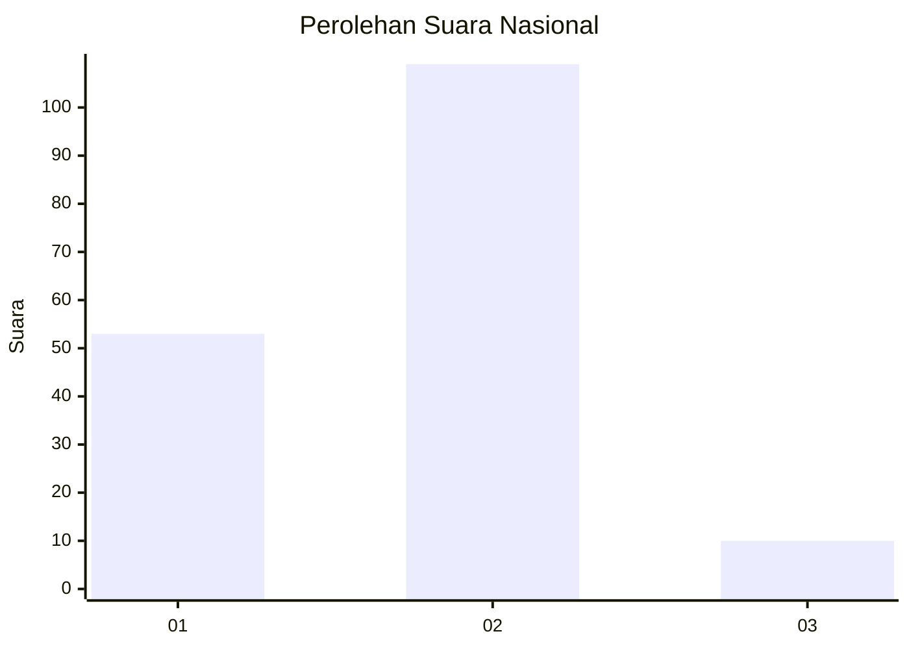
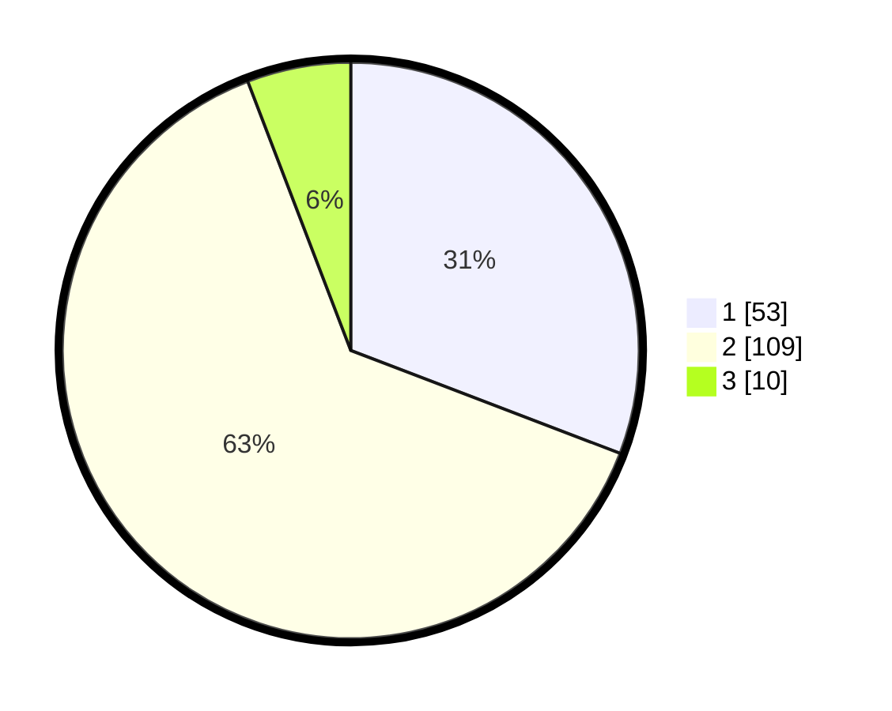

# Hasil

## Grafik

## Tabel

| No. | Nama Paslon    | Suara | Suara (raw) | Persentase |
|:--- |:-------------- | -----:| -----------:| ----------:|
| 1   | ANIES MUHAIMIN | 53    | [53][p-1]   | 30,81      |
| 2   | PRABOWO GIBRAN | 109   | [109][p-2]  | 63,37      |
| 3   | GANJAR MAHFUD  | 10    | [10][p-3]   | 5,81       |

[p-1]: https://github.com/gigit-pemilu/pemilu-2024/blob/main/pilpres/hitung-suara/sub/62-kalimantan-tengah/sub/13-barito-timur/sub/03-patangkep-tutui/sub/2003-ramania/sub/002-tps/sub/paslon-1.txt
[p-2]: https://github.com/gigit-pemilu/pemilu-2024/blob/main/pilpres/hitung-suara/sub/62-kalimantan-tengah/sub/13-barito-timur/sub/03-patangkep-tutui/sub/2003-ramania/sub/002-tps/sub/paslon-2.txt
[p-3]: https://github.com/gigit-pemilu/pemilu-2024/blob/main/pilpres/hitung-suara/sub/62-kalimantan-tengah/sub/13-barito-timur/sub/03-patangkep-tutui/sub/2003-ramania/sub/002-tps/sub/paslon-3.txt

## Foto C Plano

https://sirekap-obj-formc.kpu.go.id/806a/pemilu/ppwp/62/13/03/20/03/6213032003002-20240315-114520--14be69b9-63ec-4158-91fd-62973387cee9.jpg

https://sirekap-obj-formc.kpu.go.id/806a/pemilu/ppwp/62/13/03/20/03/6213032003002-20240216-093503--c6e8061b-1f62-4422-b559-41d98ebae190.jpg

https://sirekap-obj-formc.kpu.go.id/806a/pemilu/ppwp/62/13/03/20/03/6213032003002-20240215-214855--8458e327-82f6-4dbf-a020-f234aa321f3e.jpg

## Metadata

| Key        | Value               |
| ---------- | ------------------- |
| Time Stamp | 2024-03-15 12:00:00 |

