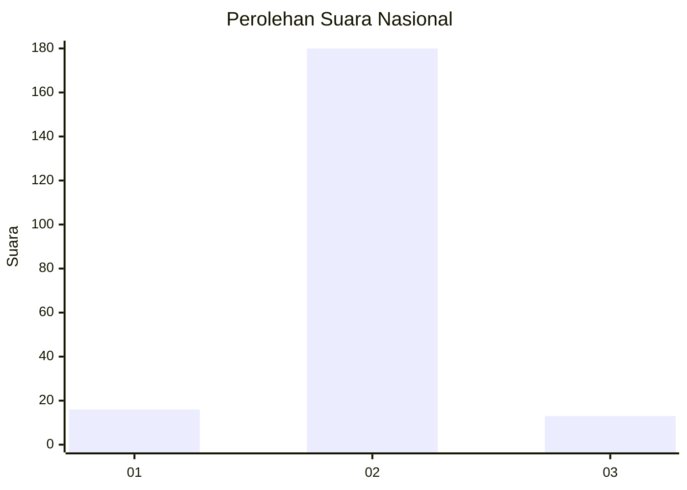
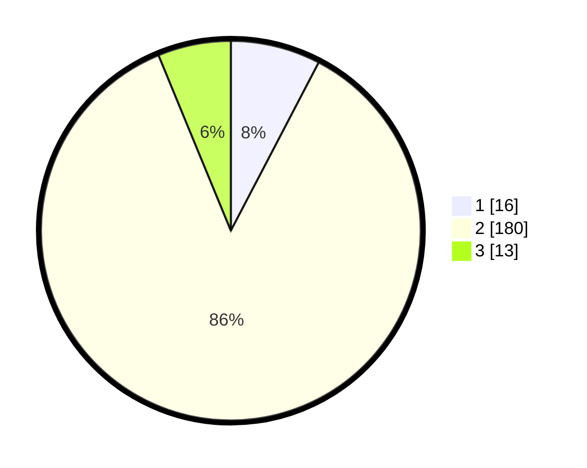

# Hasil

## Grafik

## Tabel

| No. | Nama Paslon    | Suara | Suara (raw) | Persentase |
|:--- |:-------------- | -----:| -----------:| ----------:|
| 1   | ANIES MUHAIMIN | 16    | [16][p-1]   | 7,66       |
| 2   | PRABOWO GIBRAN | 180   | [180][p-2]  | 86,12      |
| 3   | GANJAR MAHFUD  | 13    | [13][p-3]   | 6,22       |

[p-1]: https://github.com/gigit-pemilu/pemilu-2024/blob/main/pilpres/hitung-suara/sub/62-kalimantan-tengah/sub/71-kota-palangkaraya/sub/01-pahandut/sub/1001-pahandut/sub/002-tps/sub/paslon-1.txt
[p-2]: https://github.com/gigit-pemilu/pemilu-2024/blob/main/pilpres/hitung-suara/sub/62-kalimantan-tengah/sub/71-kota-palangkaraya/sub/01-pahandut/sub/1001-pahandut/sub/002-tps/sub/paslon-2.txt
[p-3]: https://github.com/gigit-pemilu/pemilu-2024/blob/main/pilpres/hitung-suara/sub/62-kalimantan-tengah/sub/71-kota-palangkaraya/sub/01-pahandut/sub/1001-pahandut/sub/002-tps/sub/paslon-3.txt

## Foto C Plano

https://sirekap-obj-formc.kpu.go.id/ce33/pemilu/ppwp/62/71/01/10/01/6271011001002-20240221-133646--05ca68b2-febc-45c1-99e1-b36f547d6f0e.jpg

https://sirekap-obj-formc.kpu.go.id/ce33/pemilu/ppwp/62/71/01/10/01/6271011001002-20240221-133908--b7848e02-1fdb-4747-a0d9-1eb1aeb1ca54.jpg

https://sirekap-obj-formc.kpu.go.id/ce33/pemilu/ppwp/62/71/01/10/01/6271011001002-20240221-134141--1f38e84a-bc65-4707-a314-f63a7d34b901.jpg

## Metadata

| Key        | Value               |
| ---------- | ------------------- |
| Time Stamp | 2024-02-24 22:31:28 |

## DATA PEMILIH TETAP

Jumlah pemilih dalam DPT: **273**.
 * L: **113**.
 * P: **160**.

## DATA PENGGUNA HAK PILIH

Jumlah pengguna hak pilih dalam DPT: **174**.
 * L: **67**.
 * P: **507**.

Jumlah pengguna hak pilih dalam DPTb: **12**.
 * L: **2**.
 * P: **0**.

Jumlah pengguna hak pilih dalam DPK: **24**.
 * L: **4**.
 * P: **20**.

Jumlah pengguna hak pilih: **210**.
 * L: **73**.
 * P: **637**.

## JUMLAH SUARA SAH DAN TIDAK SAH

JUMLAH SELURUH SUARA SAH: **209**.

JUMLAH SUARA TIDAK SAH: **1**.

JUMLAH SELURUH SUARA SAH DAN SUARA TIDAK SAH: **210**.

