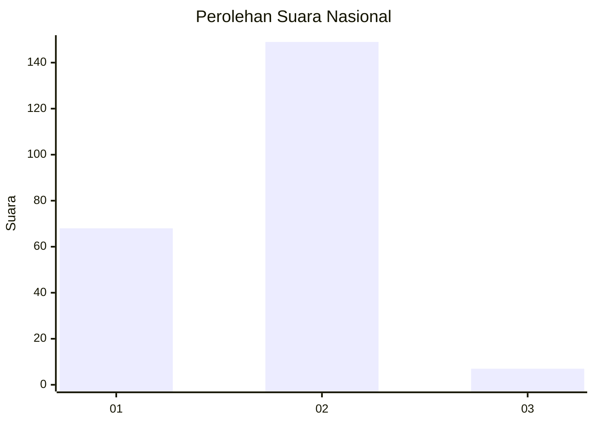
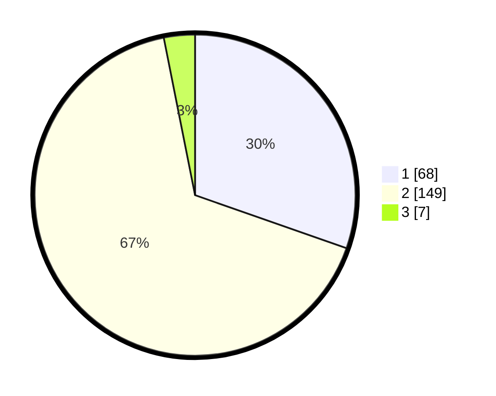

# Hasil

## Grafik

## Tabel

| No. | Nama Paslon    | Suara | Suara (raw) | Persentase |
|:--- |:-------------- | -----:| -----------:| ----------:|
| 1   | ANIES MUHAIMIN | 68    | [68][p-1]   | 30,36      |
| 2   | PRABOWO GIBRAN | 149   | [149][p-2]  | 66,52      |
| 3   | GANJAR MAHFUD  | 7     | [7][p-3]    | 3,13       |

[p-1]: https://github.com/gigit-pemilu/pemilu-2024/blob/main/pilpres/hitung-suara/sub/62-kalimantan-tengah/sub/71-kota-palangkaraya/sub/01-pahandut/sub/1001-pahandut/sub/003-tps/sub/paslon-1.txt
[p-2]: https://github.com/gigit-pemilu/pemilu-2024/blob/main/pilpres/hitung-suara/sub/62-kalimantan-tengah/sub/71-kota-palangkaraya/sub/01-pahandut/sub/1001-pahandut/sub/003-tps/sub/paslon-2.txt
[p-3]: https://github.com/gigit-pemilu/pemilu-2024/blob/main/pilpres/hitung-suara/sub/62-kalimantan-tengah/sub/71-kota-palangkaraya/sub/01-pahandut/sub/1001-pahandut/sub/003-tps/sub/paslon-3.txt

## Foto C Plano

https://sirekap-obj-formc.kpu.go.id/7291/pemilu/ppwp/62/71/01/10/01/6271011001003-20240214-215534--8d3ef1f6-1bd5-4d00-b099-b809b3408647.jpg

https://sirekap-obj-formc.kpu.go.id/7291/pemilu/ppwp/62/71/01/10/01/6271011001003-20240214-215617--8c4d69e3-1dca-4af3-9d30-308ac5633b5a.jpg

https://sirekap-obj-formc.kpu.go.id/7291/pemilu/ppwp/62/71/01/10/01/6271011001003-20240214-215649--628f2fb6-48e6-4381-82c8-058436c5e501.jpg

## Metadata

| Key        | Value               |
| ---------- | ------------------- |
| Time Stamp | 2024-02-25 13:00:00 |

