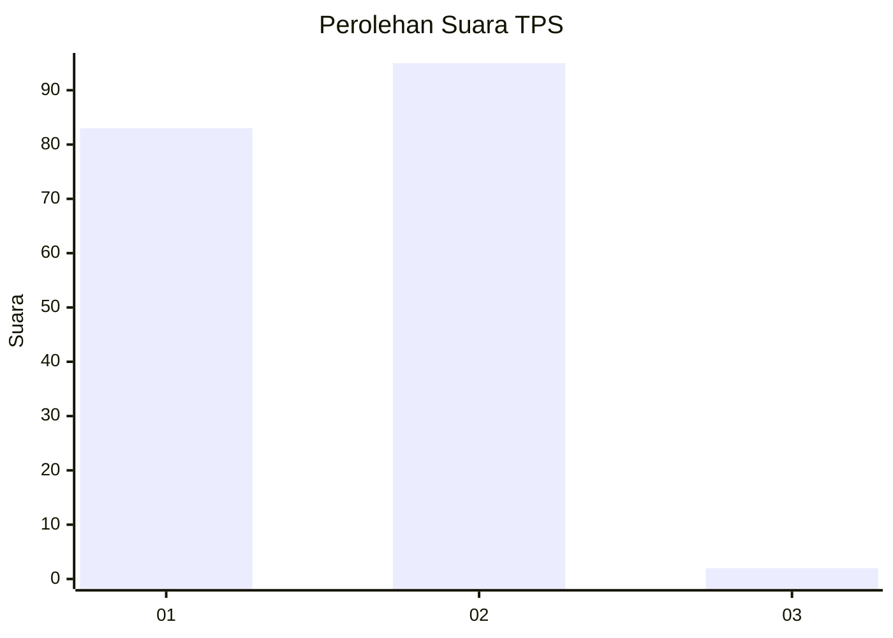
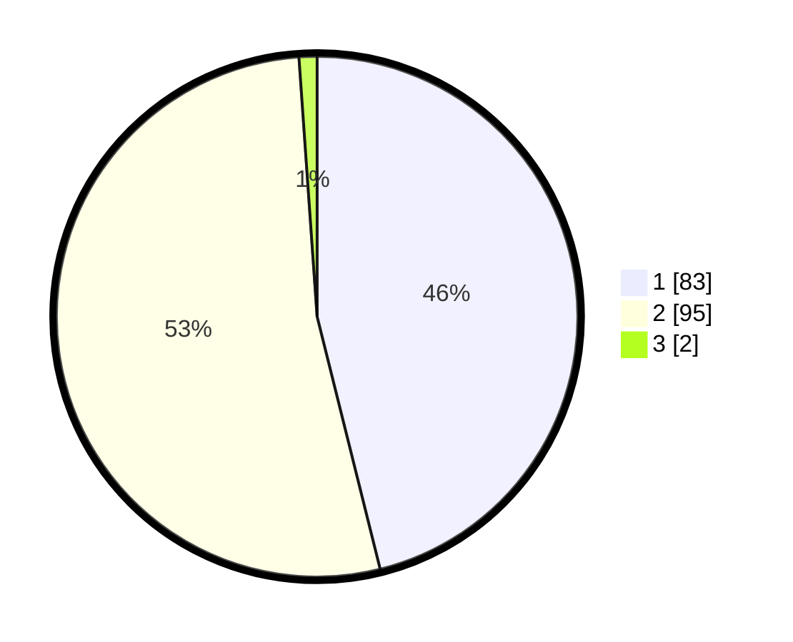

# Hasil

## Grafik

## Tabel

| No. | Nama Paslon    | Suara | Suara (raw) | Persentase |
|:--- |:-------------- | -----:| -----------:| ----------:|
| 1   | ANIES MUHAIMIN | 83    | [83][p-1]   | 46,11      |
| 2   | PRABOWO GIBRAN | 95    | [95][p-2]   | 52,78      |
| 3   | GANJAR MAHFUD  | 2     | [2][p-3]    | 1,11       |

[p-1]: https://github.com/gigit-pemilu/pemilu-2024-62-kalimantan-tengah/blob/main/pilpres/hitung-suara/sub/62-kalimantan-tengah/sub/71-kota-palangkaraya/sub/01-pahandut/sub/1001-pahandut/sub/004-tps/sub/paslon-1.txt
[p-2]: https://github.com/gigit-pemilu/pemilu-2024-62-kalimantan-tengah/blob/main/pilpres/hitung-suara/sub/62-kalimantan-tengah/sub/71-kota-palangkaraya/sub/01-pahandut/sub/1001-pahandut/sub/004-tps/sub/paslon-2.txt
[p-3]: https://github.com/gigit-pemilu/pemilu-2024-62-kalimantan-tengah/blob/main/pilpres/hitung-suara/sub/62-kalimantan-tengah/sub/71-kota-palangkaraya/sub/01-pahandut/sub/1001-pahandut/sub/004-tps/sub/paslon-3.txt

## Foto C Plano

https://sirekap-obj-formc.kpu.go.id/472c/pemilu/ppwp/62/71/01/10/01/6271011001004-20240215-001336--c04b153b-10dc-4458-b30b-57abe77a72db.jpg

https://sirekap-obj-formc.kpu.go.id/472c/pemilu/ppwp/62/71/01/10/01/6271011001004-20240215-002034--a3792704-6fc4-435c-85b3-f196634e4844.jpg

https://sirekap-obj-formc.kpu.go.id/472c/pemilu/ppwp/62/71/01/10/01/6271011001004-20240215-002042--79eb4872-d8b4-46dd-b822-894c0f262617.jpg

## Metadata

| Key        | Value               |
| ---------- | ------------------- |
| Time Stamp | 2024-02-15 15:00:29 |

