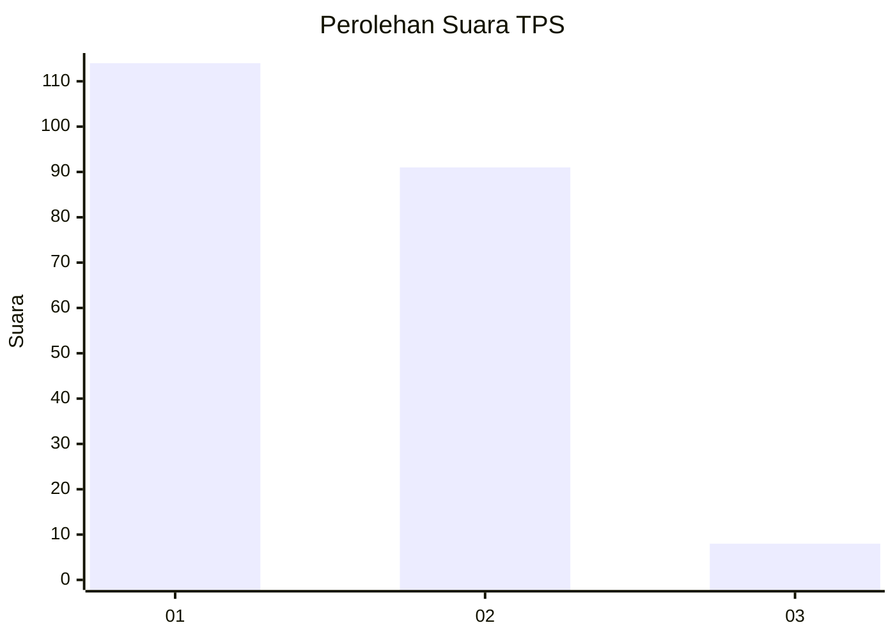
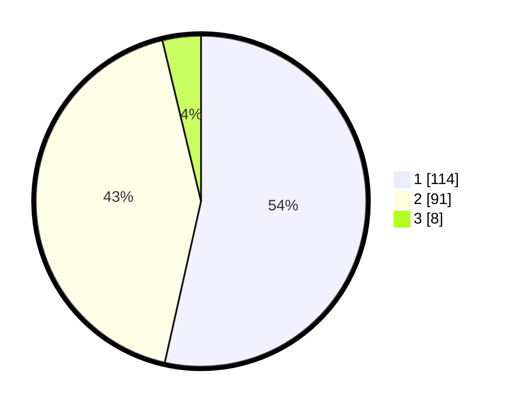

# Hasil

## Grafik

## Tabel

| No. | Nama Paslon    | Suara | Suara (raw) | Persentase |
|:--- |:-------------- | -----:| -----------:| ----------:|
| 1   | ANIES MUHAIMIN | 114   | [114][p-1]  | 53,52      |
| 2   | PRABOWO GIBRAN | 91    | [91][p-2]   | 42,72      |
| 3   | GANJAR MAHFUD  | 8     | [8][p-3]    | 3,76       |

[p-1]: https://github.com/gigit-pemilu/pemilu-2024-62-kalimantan-tengah/blob/main/pilpres/hitung-suara/sub/62-kalimantan-tengah/sub/71-kota-palangkaraya/sub/01-pahandut/sub/1001-pahandut/sub/006-tps/sub/paslon-1.txt
[p-2]: https://github.com/gigit-pemilu/pemilu-2024-62-kalimantan-tengah/blob/main/pilpres/hitung-suara/sub/62-kalimantan-tengah/sub/71-kota-palangkaraya/sub/01-pahandut/sub/1001-pahandut/sub/006-tps/sub/paslon-2.txt
[p-3]: https://github.com/gigit-pemilu/pemilu-2024-62-kalimantan-tengah/blob/main/pilpres/hitung-suara/sub/62-kalimantan-tengah/sub/71-kota-palangkaraya/sub/01-pahandut/sub/1001-pahandut/sub/006-tps/sub/paslon-3.txt

## Foto C Plano

https://sirekap-obj-formc.kpu.go.id/9ac7/pemilu/ppwp/62/71/01/10/01/6271011001006-20240214-205145--ada00309-baae-4fad-8d07-e4b02fbedbfb.jpg

https://sirekap-obj-formc.kpu.go.id/9ac7/pemilu/ppwp/62/71/01/10/01/6271011001006-20240214-205259--354ae1f3-b1da-414d-a967-988a108efe96.jpg

https://sirekap-obj-formc.kpu.go.id/9ac7/pemilu/ppwp/62/71/01/10/01/6271011001006-20240214-205348--3506bdd2-017f-4660-85dd-d83d44bbd80c.jpg

## Metadata

| Key        | Value               |
| ---------- | ------------------- |
| Time Stamp | 2024-02-24 22:31:28 |

