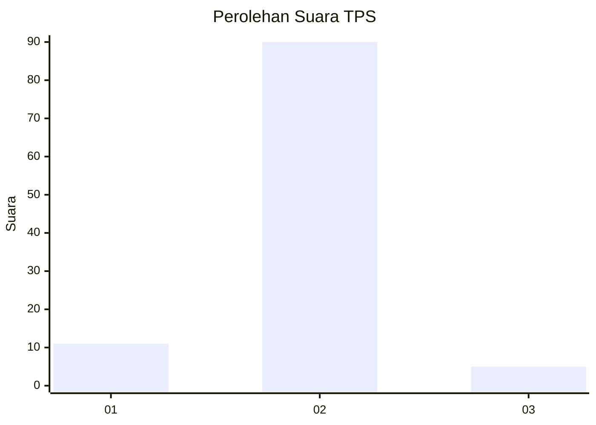
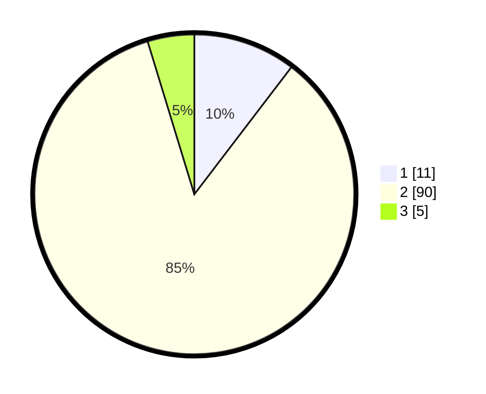

# Hasil

## Grafik

## Tabel

| No. | Nama Paslon    | Suara | Suara (raw) | Persentase |
|:--- |:-------------- | -----:| -----------:| ----------:|
| 1   | ANIES MUHAIMIN | 11    | [11][p-1]   | 10,38      |
| 2   | PRABOWO GIBRAN | 90    | [90][p-2]   | 84,91      |
| 3   | GANJAR MAHFUD  | 5     | [5][p-3]    | 4,72       |

[p-1]: https://github.com/gigit-pemilu/pemilu-2024-62-kalimantan-tengah/blob/main/pilpres/hitung-suara/sub/62-kalimantan-tengah/sub/71-kota-palangkaraya/sub/01-pahandut/sub/1001-pahandut/sub/045-tps/sub/paslon-1.txt
[p-2]: https://github.com/gigit-pemilu/pemilu-2024-62-kalimantan-tengah/blob/main/pilpres/hitung-suara/sub/62-kalimantan-tengah/sub/71-kota-palangkaraya/sub/01-pahandut/sub/1001-pahandut/sub/045-tps/sub/paslon-2.txt
[p-3]: https://github.com/gigit-pemilu/pemilu-2024-62-kalimantan-tengah/blob/main/pilpres/hitung-suara/sub/62-kalimantan-tengah/sub/71-kota-palangkaraya/sub/01-pahandut/sub/1001-pahandut/sub/045-tps/sub/paslon-3.txt

## Foto C Plano

https://sirekap-obj-formc.kpu.go.id/ba56/pemilu/ppwp/62/71/01/10/01/6271011001045-20240215-174100--d3ee4ee7-daf1-4777-94f0-21a6cdd28250.jpg

https://sirekap-obj-formc.kpu.go.id/ba56/pemilu/ppwp/62/71/01/10/01/6271011001045-20240215-054345--354c6d6b-6df1-4cd3-a837-610328d2a177.jpg

https://sirekap-obj-formc.kpu.go.id/ba56/pemilu/ppwp/62/71/01/10/01/6271011001045-20240215-054450--3d741f94-10fe-4f5c-890e-2a5ada655c29.jpg

## Metadata

| Key        | Value               |
| ---------- | ------------------- |
| Time Stamp | 2024-02-24 22:31:28 |

