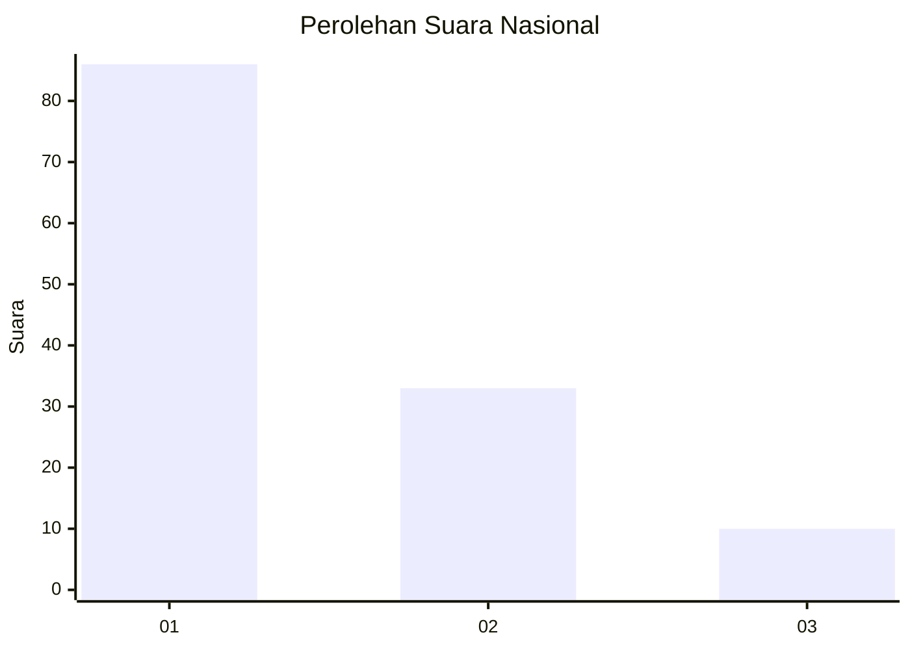
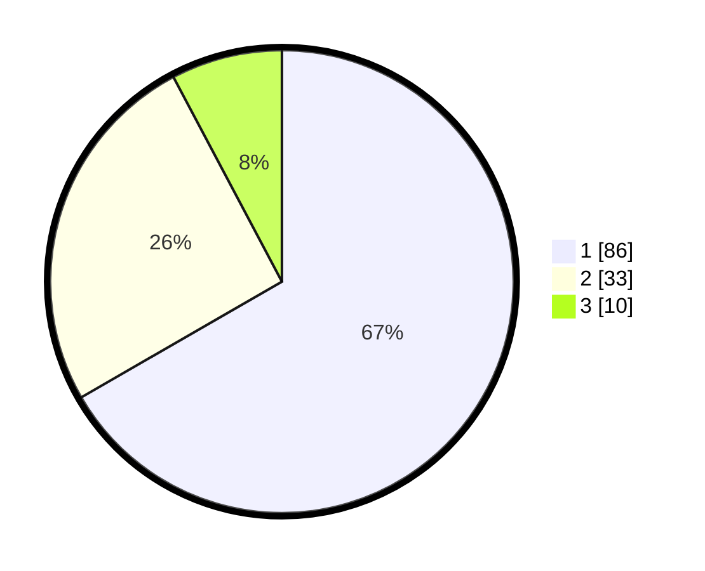

# Hasil

## Grafik

## Tabel

| No. | Nama Paslon    | Suara | Suara (raw) | Persentase |
|:--- |:-------------- | -----:| -----------:| ----------:|
| 1   | ANIES MUHAIMIN | 86    | [86][p-1]   | 66,67      |
| 2   | PRABOWO GIBRAN | 33    | [33][p-2]   | 25,58      |
| 3   | GANJAR MAHFUD  | 10    | [10][p-3]   | 7,75       |

[p-1]: https://github.com/gigit-pemilu/pemilu-2024/blob/main/pilpres/hitung-suara/sub/62-kalimantan-tengah/sub/71-kota-palangkaraya/sub/01-pahandut/sub/1002-panarung/sub/011-tps/sub/paslon-1.txt
[p-2]: https://github.com/gigit-pemilu/pemilu-2024/blob/main/pilpres/hitung-suara/sub/62-kalimantan-tengah/sub/71-kota-palangkaraya/sub/01-pahandut/sub/1002-panarung/sub/011-tps/sub/paslon-2.txt
[p-3]: https://github.com/gigit-pemilu/pemilu-2024/blob/main/pilpres/hitung-suara/sub/62-kalimantan-tengah/sub/71-kota-palangkaraya/sub/01-pahandut/sub/1002-panarung/sub/011-tps/sub/paslon-3.txt

## Foto C Plano

https://sirekap-obj-formc.kpu.go.id/cd98/pemilu/ppwp/62/71/01/10/02/6271011002011-20240216-072139--0165b2ec-9b85-4c85-8828-5aaf252c1dbb.jpg

https://sirekap-obj-formc.kpu.go.id/cd98/pemilu/ppwp/62/71/01/10/02/6271011002011-20240215-000928--2c301f48-9063-487d-9b4d-1e204837cacc.jpg

https://sirekap-obj-formc.kpu.go.id/cd98/pemilu/ppwp/62/71/01/10/02/6271011002011-20240215-001028--e722a786-6b8e-4aaf-ba3b-9c91d7140d8a.jpg

## Metadata

| Key        | Value               |
| ---------- | ------------------- |
| Time Stamp | 2024-02-16 08:00:28 |

