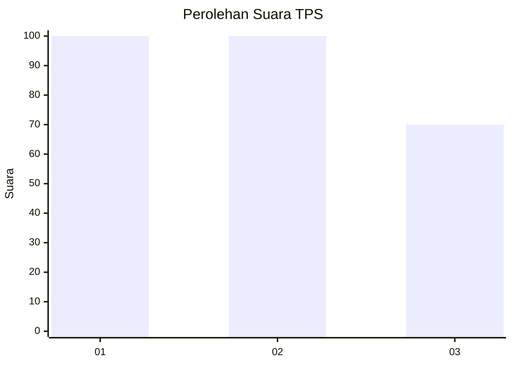
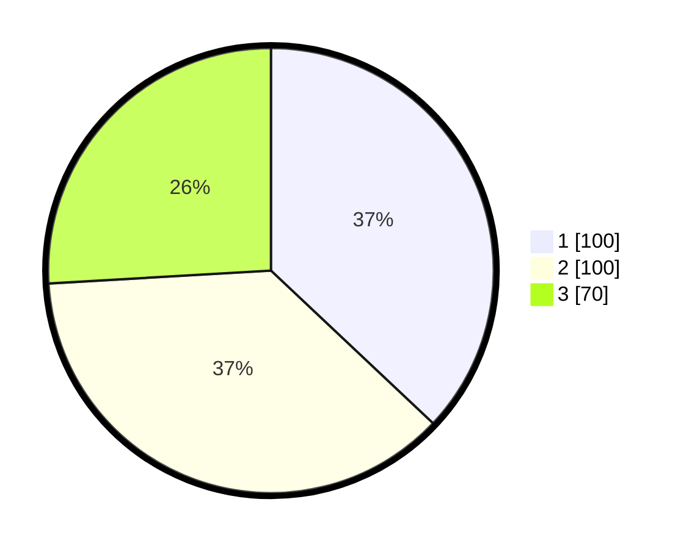

# Hasil

## Grafik

## Tabel

| No. | Nama Paslon    | Suara | Suara (raw) | Persentase |
|:--- |:-------------- | -----:| -----------:| ----------:|
| 1   | ANIES MUHAIMIN | 100   | [100][p-1]  | 37,04      |
| 2   | PRABOWO GIBRAN | 100   | [100][p-2]  | 37,04      |
| 3   | GANJAR MAHFUD  | 70    | [70][p-3]   | 25,93      |

[p-1]: https://github.com/gigit-pemilu/pemilu-2024-62-kalimantan-tengah/blob/main/pilpres/hitung-suara/sub/62-kalimantan-tengah/sub/71-kota-palangkaraya/sub/01-pahandut/sub/1003-langkai/sub/007-tps/sub/paslon-1.txt
[p-2]: https://github.com/gigit-pemilu/pemilu-2024-62-kalimantan-tengah/blob/main/pilpres/hitung-suara/sub/62-kalimantan-tengah/sub/71-kota-palangkaraya/sub/01-pahandut/sub/1003-langkai/sub/007-tps/sub/paslon-2.txt
[p-3]: https://github.com/gigit-pemilu/pemilu-2024-62-kalimantan-tengah/blob/main/pilpres/hitung-suara/sub/62-kalimantan-tengah/sub/71-kota-palangkaraya/sub/01-pahandut/sub/1003-langkai/sub/007-tps/sub/paslon-3.txt

## Foto C Plano

https://sirekap-obj-formc.kpu.go.id/345a/pemilu/ppwp/62/71/01/10/03/6271011003007-20240214-100830--e3545566-653b-4186-88fa-2c9eafc11134.jpg

https://sirekap-obj-formc.kpu.go.id/345a/pemilu/ppwp/62/71/01/10/03/6271011003007-20240214-101025--f6915271-c7cc-4458-833b-a607833c4aa4.jpg

https://sirekap-obj-formc.kpu.go.id/345a/pemilu/ppwp/62/71/01/10/03/6271011003007-20240214-101648--0faf2694-11cd-4f13-a493-411cc9406650.jpg

## Metadata

| Key        | Value               |
| ---------- | ------------------- |
| Time Stamp | 2024-02-15 20:30:46 |

