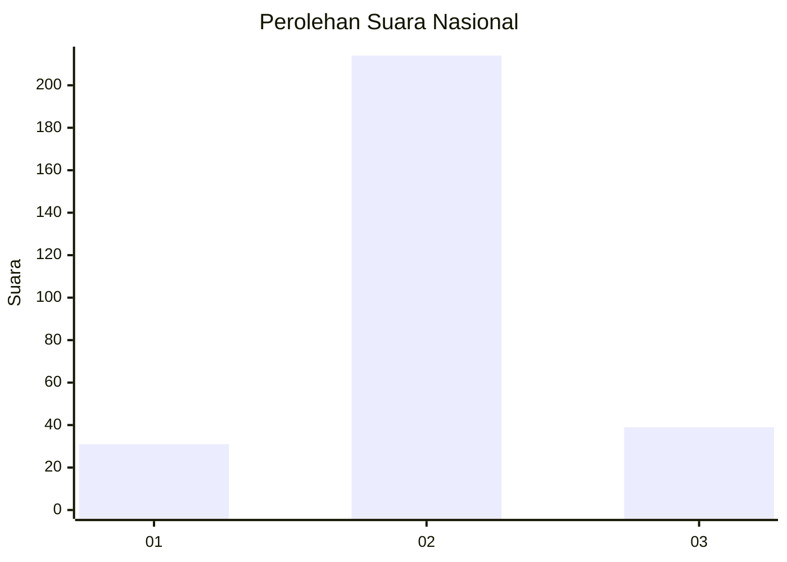
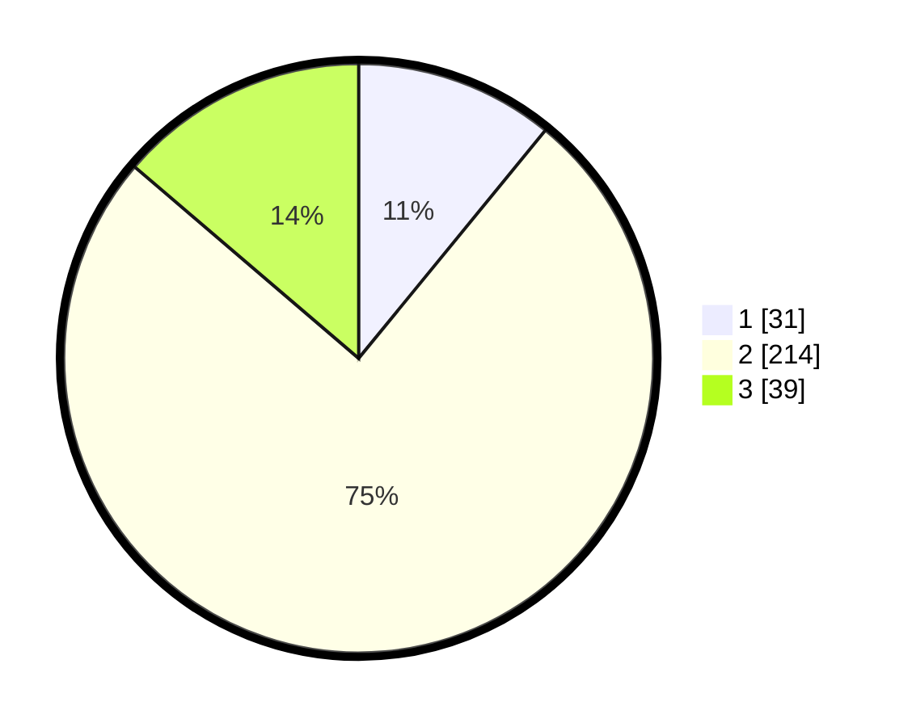

# Hasil

## Grafik

## Tabel

| No. | Nama Paslon    | Suara | Suara (raw) | Persentase |
|:--- |:-------------- | -----:| -----------:| ----------:|
| 1   | ANIES MUHAIMIN | 31    | [31][p-1]   | 10,92      |
| 2   | PRABOWO GIBRAN | 214   | [214][p-2]  | 75,35      |
| 3   | GANJAR MAHFUD  | 39    | [39][p-3]   | 13,73      |

[p-1]: https://github.com/gigit-pemilu/pemilu-2024/blob/main/pilpres/hitung-suara/sub/62-kalimantan-tengah/sub/71-kota-palangkaraya/sub/01-pahandut/sub/1003-langkai/sub/015-tps/sub/paslon-1.txt
[p-2]: https://github.com/gigit-pemilu/pemilu-2024/blob/main/pilpres/hitung-suara/sub/62-kalimantan-tengah/sub/71-kota-palangkaraya/sub/01-pahandut/sub/1003-langkai/sub/015-tps/sub/paslon-2.txt
[p-3]: https://github.com/gigit-pemilu/pemilu-2024/blob/main/pilpres/hitung-suara/sub/62-kalimantan-tengah/sub/71-kota-palangkaraya/sub/01-pahandut/sub/1003-langkai/sub/015-tps/sub/paslon-3.txt

## Foto C Plano

https://sirekap-obj-formc.kpu.go.id/10fe/pemilu/ppwp/62/71/01/10/03/6271011003015-20240214-185741--a13a55f4-848b-461d-8cc6-b23f998e2208.jpg

https://sirekap-obj-formc.kpu.go.id/10fe/pemilu/ppwp/62/71/01/10/03/6271011003015-20240214-185139--693862d4-b0ad-4235-b8e0-c5ce90128635.jpg

https://sirekap-obj-formc.kpu.go.id/10fe/pemilu/ppwp/62/71/01/10/03/6271011003015-20240214-185531--e0bad1a1-a62d-4e46-869c-bbe96c48ac29.jpg

## Metadata

| Key        | Value               |
| ---------- | ------------------- |
| Time Stamp | 2024-02-25 17:00:00 |

