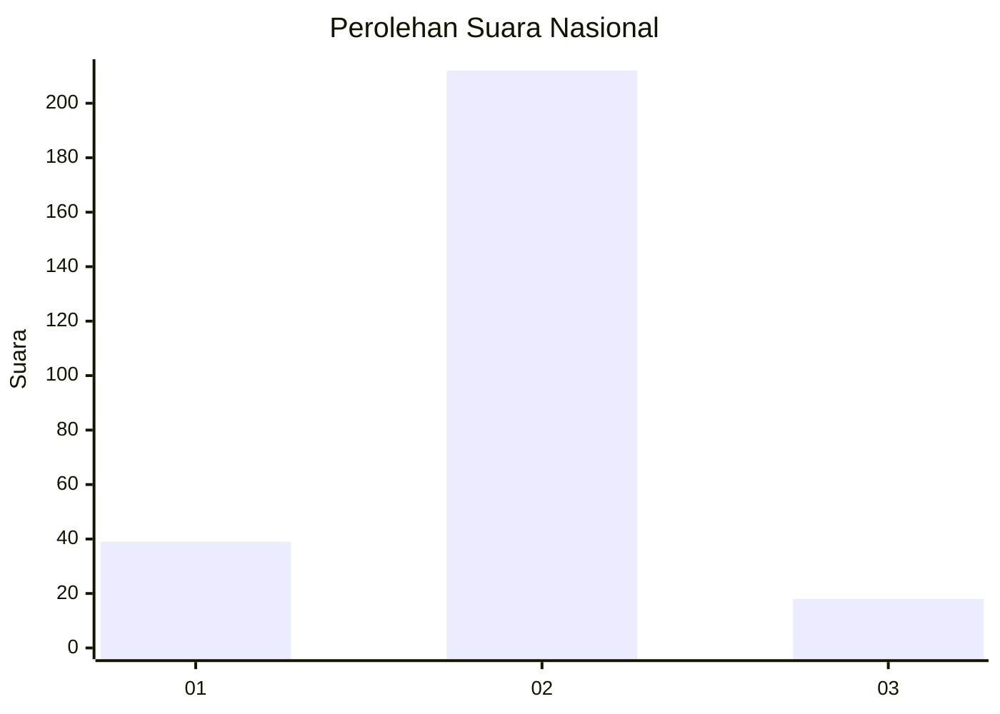
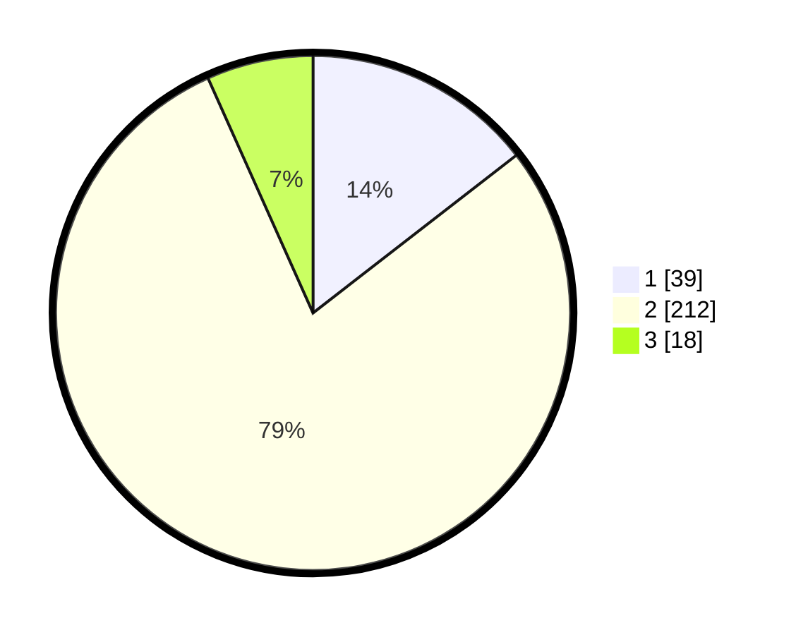

# Hasil

## Grafik

## Tabel

| No. | Nama Paslon    | Suara | Suara (raw) | Persentase |
|:--- |:-------------- | -----:| -----------:| ----------:|
| 1   | ANIES MUHAIMIN | 39    | [39][p-1]   | 14,50      |
| 2   | PRABOWO GIBRAN | 212   | [212][p-2]  | 78,81      |
| 3   | GANJAR MAHFUD  | 18    | [18][p-3]   | 6,69       |

[p-1]: https://github.com/gigit-pemilu/pemilu-2024/blob/main/pilpres/hitung-suara/sub/62-kalimantan-tengah/sub/71-kota-palangkaraya/sub/01-pahandut/sub/1003-langkai/sub/049-tps/sub/paslon-1.txt
[p-2]: https://github.com/gigit-pemilu/pemilu-2024/blob/main/pilpres/hitung-suara/sub/62-kalimantan-tengah/sub/71-kota-palangkaraya/sub/01-pahandut/sub/1003-langkai/sub/049-tps/sub/paslon-2.txt
[p-3]: https://github.com/gigit-pemilu/pemilu-2024/blob/main/pilpres/hitung-suara/sub/62-kalimantan-tengah/sub/71-kota-palangkaraya/sub/01-pahandut/sub/1003-langkai/sub/049-tps/sub/paslon-3.txt

## Foto C Plano

https://sirekap-obj-formc.kpu.go.id/d339/pemilu/ppwp/62/71/01/10/03/6271011003049-20240215-091023--805a8fc7-bf25-4f78-9040-65b78ac2bb31.jpg

https://sirekap-obj-formc.kpu.go.id/d339/pemilu/ppwp/62/71/01/10/03/6271011003049-20240215-091132--09b6e58c-a527-41aa-a9e3-d3d0dedf7706.jpg

https://sirekap-obj-formc.kpu.go.id/d339/pemilu/ppwp/62/71/01/10/03/6271011003049-20240215-091246--499bf66a-07e2-4265-b37a-c1b18f72bc7d.jpg

## Metadata

| Key        | Value               |
| ---------- | ------------------- |
| Time Stamp | 2024-02-25 12:00:00 |

