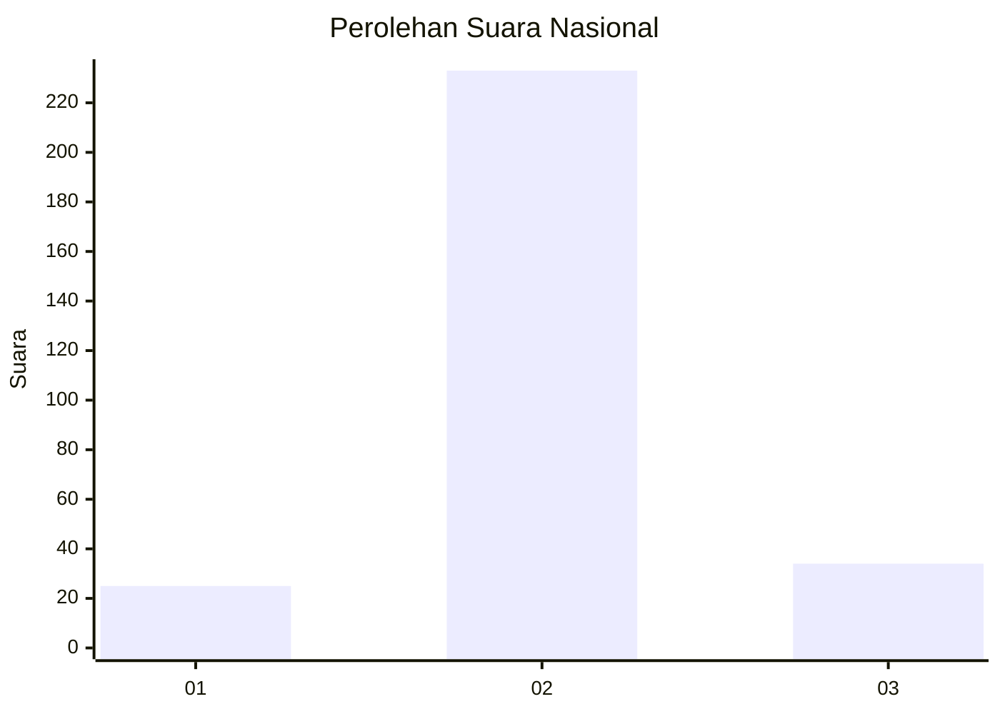
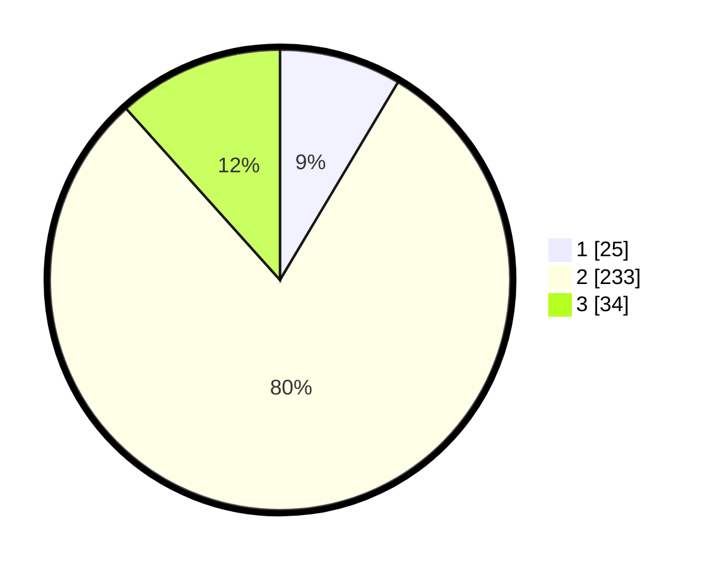

# Hasil

## Grafik

## Tabel

| No. | Nama Paslon    | Suara | Suara (raw) | Persentase |
|:--- |:-------------- | -----:| -----------:| ----------:|
| 1   | ANIES MUHAIMIN | 25    | [25][p-1]   | 8,56       |
| 2   | PRABOWO GIBRAN | 233   | [233][p-2]  | 79,79      |
| 3   | GANJAR MAHFUD  | 34    | [34][p-3]   | 11,64      |

[p-1]: https://github.com/gigit-pemilu/pemilu-2024/blob/main/pilpres/hitung-suara/sub/62-kalimantan-tengah/sub/71-kota-palangkaraya/sub/01-pahandut/sub/1003-langkai/sub/059-tps/sub/paslon-1.txt
[p-2]: https://github.com/gigit-pemilu/pemilu-2024/blob/main/pilpres/hitung-suara/sub/62-kalimantan-tengah/sub/71-kota-palangkaraya/sub/01-pahandut/sub/1003-langkai/sub/059-tps/sub/paslon-2.txt
[p-3]: https://github.com/gigit-pemilu/pemilu-2024/blob/main/pilpres/hitung-suara/sub/62-kalimantan-tengah/sub/71-kota-palangkaraya/sub/01-pahandut/sub/1003-langkai/sub/059-tps/sub/paslon-3.txt

## Foto C Plano

https://sirekap-obj-formc.kpu.go.id/65b4/pemilu/ppwp/62/71/01/10/03/6271011003059-20240214-234259--ae62c612-dad4-49bc-bb78-8bc02dd8e690.jpg

https://sirekap-obj-formc.kpu.go.id/65b4/pemilu/ppwp/62/71/01/10/03/6271011003059-20240214-233302--486f7c72-9505-47de-8f3d-0e72c5320874.jpg

https://sirekap-obj-formc.kpu.go.id/65b4/pemilu/ppwp/62/71/01/10/03/6271011003059-20240214-233440--c640e32c-7674-4892-b6e9-6a2074c3465f.jpg

## Metadata

| Key        | Value               |
| ---------- | ------------------- |
| Time Stamp | 2024-02-24 22:31:28 |

