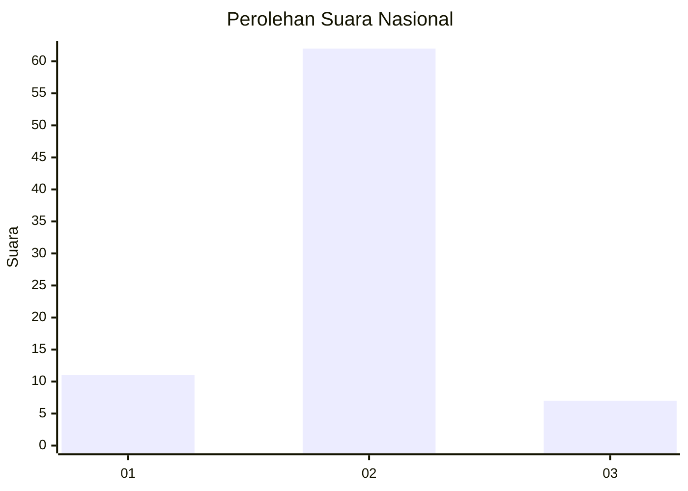
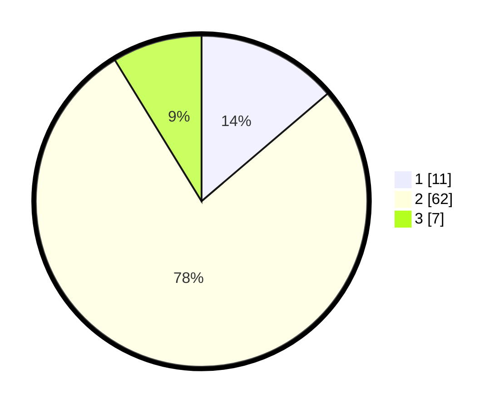

# Hasil

## Grafik

## Tabel

| No. | Nama Paslon    | Suara | Suara (raw) | Persentase |
|:--- |:-------------- | -----:| -----------:| ----------:|
| 1   | ANIES MUHAIMIN | 11    | [11][p-1]   | 13,75      |
| 2   | PRABOWO GIBRAN | 62    | [62][p-2]   | 77,50      |
| 3   | GANJAR MAHFUD  | 7     | [7][p-3]    | 8,75       |

[p-1]: https://github.com/gigit-pemilu/pemilu-2024/blob/main/pilpres/hitung-suara/sub/62-kalimantan-tengah/sub/71-kota-palangkaraya/sub/02-bukit-batu/sub/1001-marang/sub/002-tps/sub/paslon-1.txt
[p-2]: https://github.com/gigit-pemilu/pemilu-2024/blob/main/pilpres/hitung-suara/sub/62-kalimantan-tengah/sub/71-kota-palangkaraya/sub/02-bukit-batu/sub/1001-marang/sub/002-tps/sub/paslon-2.txt
[p-3]: https://github.com/gigit-pemilu/pemilu-2024/blob/main/pilpres/hitung-suara/sub/62-kalimantan-tengah/sub/71-kota-palangkaraya/sub/02-bukit-batu/sub/1001-marang/sub/002-tps/sub/paslon-3.txt

## Foto C Plano

https://sirekap-obj-formc.kpu.go.id/1b48/pemilu/ppwp/62/71/02/10/01/6271021001002-20240214-193207--a1d0f673-0310-49ea-a488-48703070e279.jpg

https://sirekap-obj-formc.kpu.go.id/1b48/pemilu/ppwp/62/71/02/10/01/6271021001002-20240214-193236--2c85437f-d41b-4ff6-a251-c4d86135384e.jpg

https://sirekap-obj-formc.kpu.go.id/1b48/pemilu/ppwp/62/71/02/10/01/6271021001002-20240214-193323--11c5faad-ccc4-4b03-b1c9-1dfcefd69ba5.jpg

## Metadata

| Key        | Value               |
| ---------- | ------------------- |
| Time Stamp | 2024-02-15 20:30:46 |

## DATA PEMILIH TETAP

Jumlah pemilih dalam DPT: **106**.
 * L: **60**.
 * P: **46**.

## DATA PENGGUNA HAK PILIH

Jumlah pengguna hak pilih dalam DPT: **80**.
 * L: **44**.
 * P: **36**.

Jumlah pengguna hak pilih dalam DPTb: **0**.
 * L: **0**.
 * P: **0**.

Jumlah pengguna hak pilih dalam DPK: **2**.
 * L: **1**.
 * P: **1**.

Jumlah pengguna hak pilih: **82**.
 * L: **45**.
 * P: **37**.

## JUMLAH SUARA SAH DAN TIDAK SAH

JUMLAH SELURUH SUARA SAH: **80**.

JUMLAH SUARA TIDAK SAH: **2**.

JUMLAH SELURUH SUARA SAH DAN SUARA TIDAK SAH: **82**.

