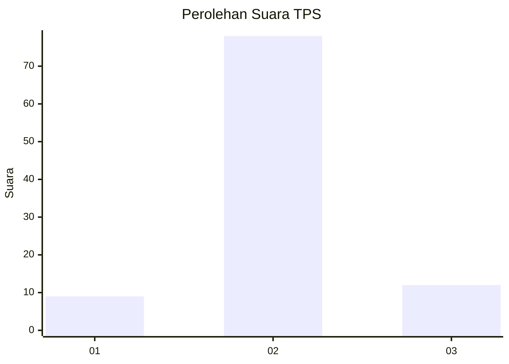
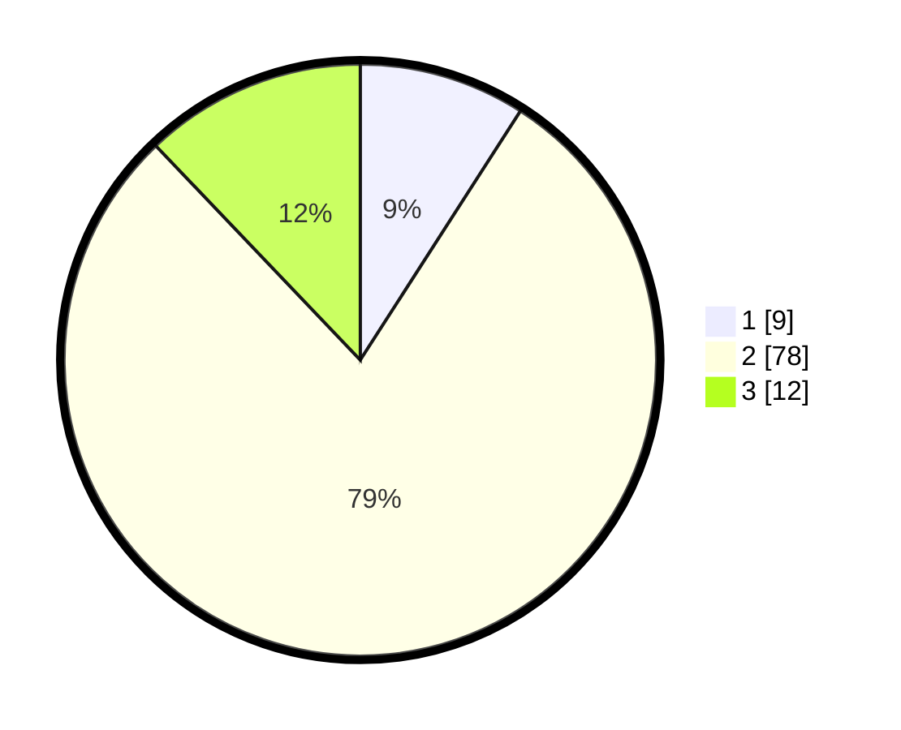

# Hasil

## Grafik

## Tabel

| No. | Nama Paslon    | Suara | Suara (raw) | Persentase |
|:--- |:-------------- | -----:| -----------:| ----------:|
| 1   | ANIES MUHAIMIN | 9     | [9][p-1]    | 9,09       |
| 2   | PRABOWO GIBRAN | 78    | [78][p-2]   | 78,79      |
| 3   | GANJAR MAHFUD  | 12    | [12][p-3]   | 12,12      |

[p-1]: https://github.com/gigit-pemilu/pemilu-2024-62-kalimantan-tengah/blob/main/pilpres/hitung-suara/sub/62-kalimantan-tengah/sub/71-kota-palangkaraya/sub/02-bukit-batu/sub/1002-tumbang-tahai/sub/002-tps/sub/paslon-1.txt
[p-2]: https://github.com/gigit-pemilu/pemilu-2024-62-kalimantan-tengah/blob/main/pilpres/hitung-suara/sub/62-kalimantan-tengah/sub/71-kota-palangkaraya/sub/02-bukit-batu/sub/1002-tumbang-tahai/sub/002-tps/sub/paslon-2.txt
[p-3]: https://github.com/gigit-pemilu/pemilu-2024-62-kalimantan-tengah/blob/main/pilpres/hitung-suara/sub/62-kalimantan-tengah/sub/71-kota-palangkaraya/sub/02-bukit-batu/sub/1002-tumbang-tahai/sub/002-tps/sub/paslon-3.txt

## Foto C Plano

https://sirekap-obj-formc.kpu.go.id/4779/pemilu/ppwp/62/71/02/10/02/6271021002002-20240215-012759--86a5a3ce-aec9-4978-ba4e-a816205b7157.jpg

https://sirekap-obj-formc.kpu.go.id/4779/pemilu/ppwp/62/71/02/10/02/6271021002002-20240215-013019--e7842813-854c-4ed8-bd68-8173f4f5e5db.jpg

https://sirekap-obj-formc.kpu.go.id/4779/pemilu/ppwp/62/71/02/10/02/6271021002002-20240215-012922--9cb05e3c-0999-4d23-9e2d-49ef4b1f96e0.jpg

## Metadata

| Key        | Value               |
| ---------- | ------------------- |
| Time Stamp | 2024-02-25 17:00:00 |

