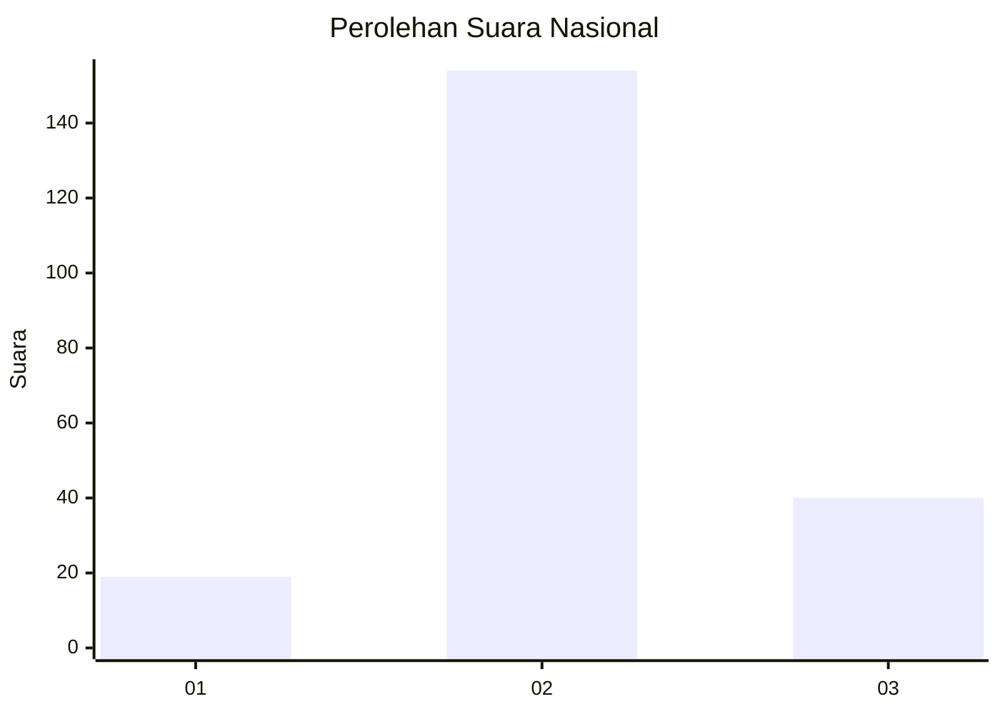
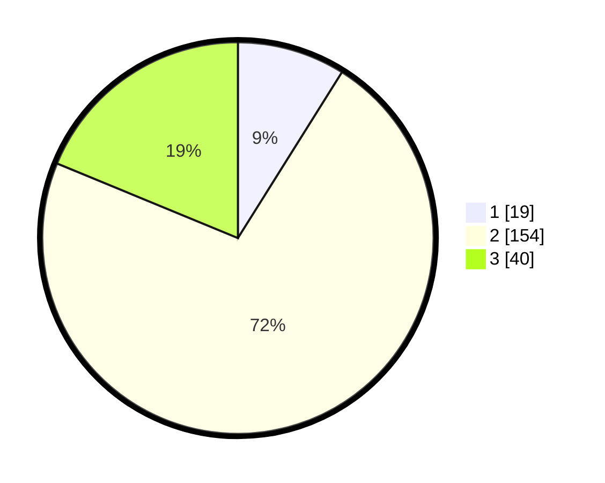

# Hasil

## Grafik

## Tabel

| No. | Nama Paslon    | Suara | Suara (raw) | Persentase |
|:--- |:-------------- | -----:| -----------:| ----------:|
| 1   | ANIES MUHAIMIN | 19    | [19][p-1]   | 8,92       |
| 2   | PRABOWO GIBRAN | 154   | [154][p-2]  | 72,30      |
| 3   | GANJAR MAHFUD  | 40    | [40][p-3]   | 18,78      |

[p-1]: https://github.com/gigit-pemilu/pemilu-2024/blob/main/pilpres/hitung-suara/sub/62-kalimantan-tengah/sub/71-kota-palangkaraya/sub/02-bukit-batu/sub/1002-tumbang-tahai/sub/004-tps/sub/paslon-1.txt
[p-2]: https://github.com/gigit-pemilu/pemilu-2024/blob/main/pilpres/hitung-suara/sub/62-kalimantan-tengah/sub/71-kota-palangkaraya/sub/02-bukit-batu/sub/1002-tumbang-tahai/sub/004-tps/sub/paslon-2.txt
[p-3]: https://github.com/gigit-pemilu/pemilu-2024/blob/main/pilpres/hitung-suara/sub/62-kalimantan-tengah/sub/71-kota-palangkaraya/sub/02-bukit-batu/sub/1002-tumbang-tahai/sub/004-tps/sub/paslon-3.txt

## Foto C Plano

https://sirekap-obj-formc.kpu.go.id/e1f1/pemilu/ppwp/62/71/02/10/02/6271021002004-20240214-204440--300dcabf-fe5e-4ff2-9b80-11d92bbec98f.jpg

https://sirekap-obj-formc.kpu.go.id/e1f1/pemilu/ppwp/62/71/02/10/02/6271021002004-20240214-204646--989a528a-290f-48b6-949a-1d1cef231d37.jpg

https://sirekap-obj-formc.kpu.go.id/e1f1/pemilu/ppwp/62/71/02/10/02/6271021002004-20240214-204831--d1ae8b53-35a6-4537-8750-d9e4ee1565fd.jpg

## Metadata

| Key        | Value               |
| ---------- | ------------------- |
| Time Stamp | 2024-02-25 11:00:00 |

