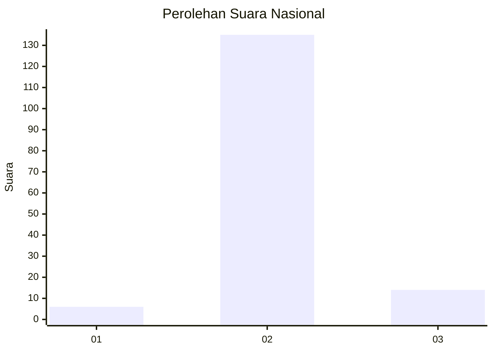
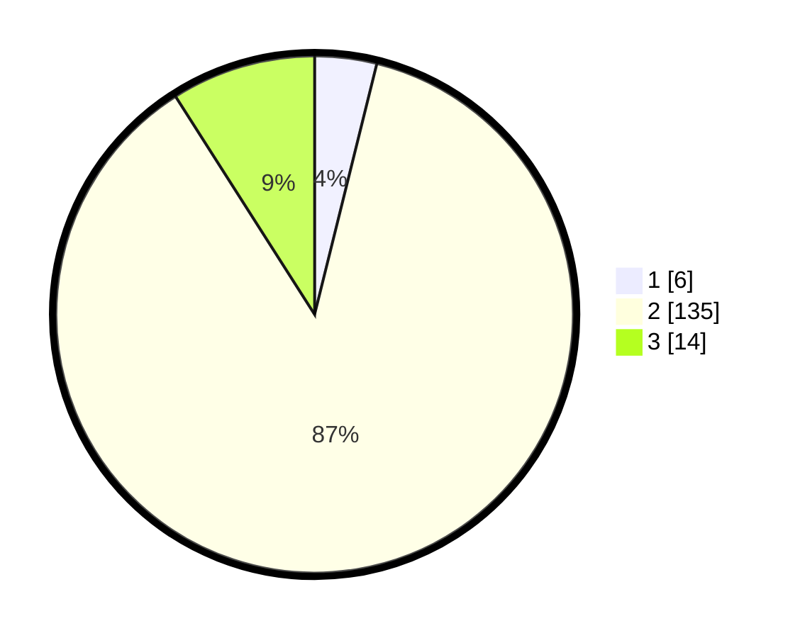

# Hasil

## Grafik

## Tabel

| No. | Nama Paslon    | Suara | Suara (raw) | Persentase |
|:--- |:-------------- | -----:| -----------:| ----------:|
| 1   | ANIES MUHAIMIN | 6     | [6][p-1]    | 3,87       |
| 2   | PRABOWO GIBRAN | 135   | [135][p-2]  | 87,10      |
| 3   | GANJAR MAHFUD  | 14    | [14][p-3]   | 9,03       |

[p-1]: https://github.com/gigit-pemilu/pemilu-2024/blob/main/pilpres/hitung-suara/sub/62-kalimantan-tengah/sub/71-kota-palangkaraya/sub/02-bukit-batu/sub/1005-sei-gohong/sub/001-tps/sub/paslon-1.txt
[p-2]: https://github.com/gigit-pemilu/pemilu-2024/blob/main/pilpres/hitung-suara/sub/62-kalimantan-tengah/sub/71-kota-palangkaraya/sub/02-bukit-batu/sub/1005-sei-gohong/sub/001-tps/sub/paslon-2.txt
[p-3]: https://github.com/gigit-pemilu/pemilu-2024/blob/main/pilpres/hitung-suara/sub/62-kalimantan-tengah/sub/71-kota-palangkaraya/sub/02-bukit-batu/sub/1005-sei-gohong/sub/001-tps/sub/paslon-3.txt

## Foto C Plano

https://sirekap-obj-formc.kpu.go.id/1944/pemilu/ppwp/62/71/02/10/05/6271021005001-20240215-000704--2274e1ac-1475-4a8b-b8f8-afd8bf46517f.jpg

https://sirekap-obj-formc.kpu.go.id/1944/pemilu/ppwp/62/71/02/10/05/6271021005001-20240215-000805--f67caac5-32d0-44eb-ae82-99d5caffb2e5.jpg

https://sirekap-obj-formc.kpu.go.id/1944/pemilu/ppwp/62/71/02/10/05/6271021005001-20240215-001034--092bd7c0-db68-4b7e-80b4-adeba225b204.jpg

## Metadata

| Key        | Value               |
| ---------- | ------------------- |
| Time Stamp | 2024-02-24 22:31:28 |

