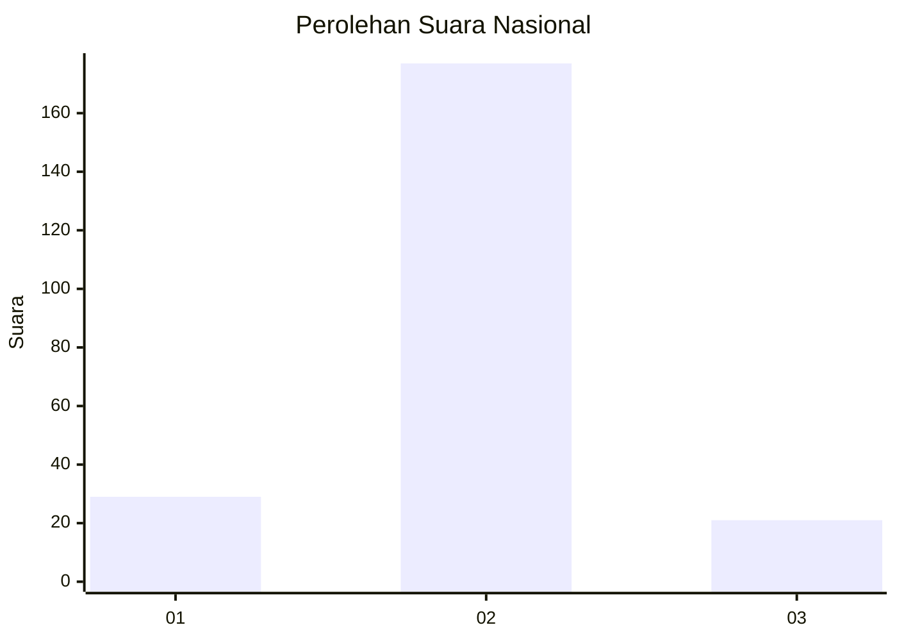
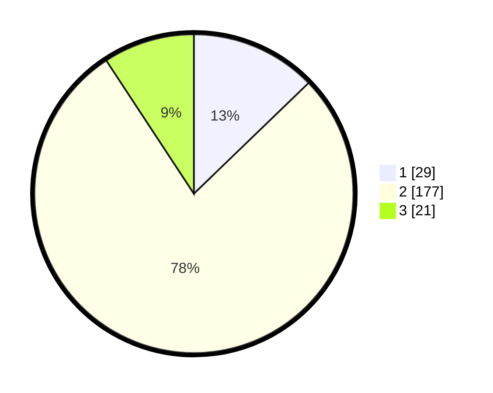

# Hasil

## Grafik

## Tabel

| No. | Nama Paslon    | Suara | Suara (raw) | Persentase |
|:--- |:-------------- | -----:| -----------:| ----------:|
| 1   | ANIES MUHAIMIN | 29    | [29][p-1]   | 12,78      |
| 2   | PRABOWO GIBRAN | 177   | [177][p-2]  | 77,97      |
| 3   | GANJAR MAHFUD  | 21    | [21][p-3]   | 9,25       |

[p-1]: https://github.com/gigit-pemilu/pemilu-2024/blob/main/pilpres/hitung-suara/sub/62-kalimantan-tengah/sub/71-kota-palangkaraya/sub/03-jekan-raya/sub/1001-palangka/sub/003-tps/sub/paslon-1.txt
[p-2]: https://github.com/gigit-pemilu/pemilu-2024/blob/main/pilpres/hitung-suara/sub/62-kalimantan-tengah/sub/71-kota-palangkaraya/sub/03-jekan-raya/sub/1001-palangka/sub/003-tps/sub/paslon-2.txt
[p-3]: https://github.com/gigit-pemilu/pemilu-2024/blob/main/pilpres/hitung-suara/sub/62-kalimantan-tengah/sub/71-kota-palangkaraya/sub/03-jekan-raya/sub/1001-palangka/sub/003-tps/sub/paslon-3.txt

## Foto C Plano

https://sirekap-obj-formc.kpu.go.id/1576/pemilu/ppwp/62/71/03/10/01/6271031001003-20240214-220435--2c4aa51f-0330-4c92-9ddb-c3537ada4168.jpg

https://sirekap-obj-formc.kpu.go.id/1576/pemilu/ppwp/62/71/03/10/01/6271031001003-20240214-221118--50e50a08-9523-43dc-b780-e58d966a5ffd.jpg

https://sirekap-obj-formc.kpu.go.id/1576/pemilu/ppwp/62/71/03/10/01/6271031001003-20240214-221804--d5e98d44-a730-46ad-bc34-e0f913ca9c54.jpg

## Metadata

| Key        | Value               |
| ---------- | ------------------- |
| Time Stamp | 2024-02-25 14:00:00 |

