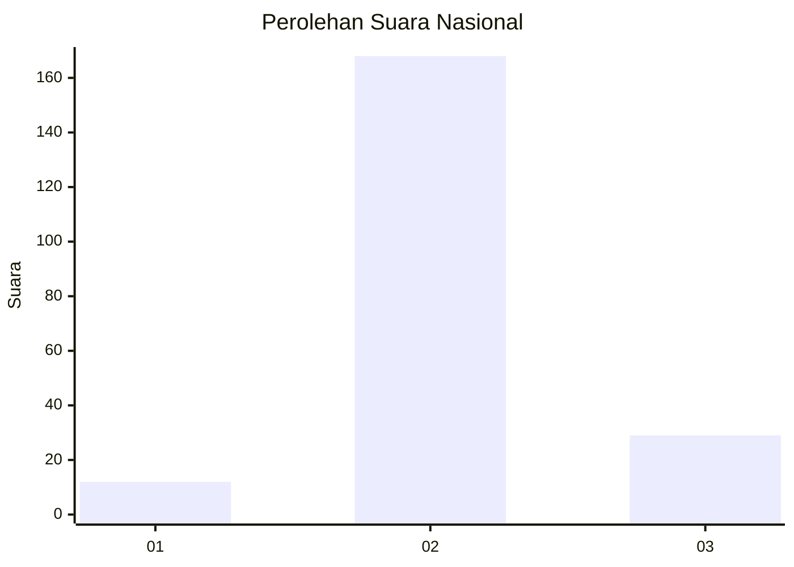
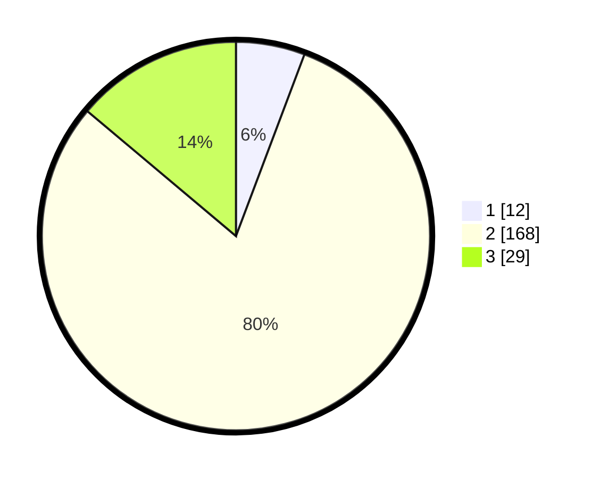

# Hasil

## Grafik

## Tabel

| No. | Nama Paslon    | Suara | Suara (raw) | Persentase |
|:--- |:-------------- | -----:| -----------:| ----------:|
| 1   | ANIES MUHAIMIN | 12    | [12][p-1]   | 5,74       |
| 2   | PRABOWO GIBRAN | 168   | [168][p-2]  | 80,38      |
| 3   | GANJAR MAHFUD  | 29    | [29][p-3]   | 13,88      |

[p-1]: https://github.com/gigit-pemilu/pemilu-2024/blob/main/pilpres/hitung-suara/sub/62-kalimantan-tengah/sub/71-kota-palangkaraya/sub/03-jekan-raya/sub/1001-palangka/sub/004-tps/sub/paslon-1.txt
[p-2]: https://github.com/gigit-pemilu/pemilu-2024/blob/main/pilpres/hitung-suara/sub/62-kalimantan-tengah/sub/71-kota-palangkaraya/sub/03-jekan-raya/sub/1001-palangka/sub/004-tps/sub/paslon-2.txt
[p-3]: https://github.com/gigit-pemilu/pemilu-2024/blob/main/pilpres/hitung-suara/sub/62-kalimantan-tengah/sub/71-kota-palangkaraya/sub/03-jekan-raya/sub/1001-palangka/sub/004-tps/sub/paslon-3.txt

## Foto C Plano

https://sirekap-obj-formc.kpu.go.id/0207/pemilu/ppwp/62/71/03/10/01/6271031001004-20240215-000015--47754062-10ca-4086-a033-836d25646351.jpg

https://sirekap-obj-formc.kpu.go.id/0207/pemilu/ppwp/62/71/03/10/01/6271031001004-20240215-000100--13413bde-2e59-442b-b031-0e0ec92d6d26.jpg

https://sirekap-obj-formc.kpu.go.id/0207/pemilu/ppwp/62/71/03/10/01/6271031001004-20240215-000159--686be5be-988a-4c8c-8012-8c09ad214f00.jpg

## Metadata

| Key        | Value               |
| ---------- | ------------------- |
| Time Stamp | 2024-02-24 22:31:28 |

