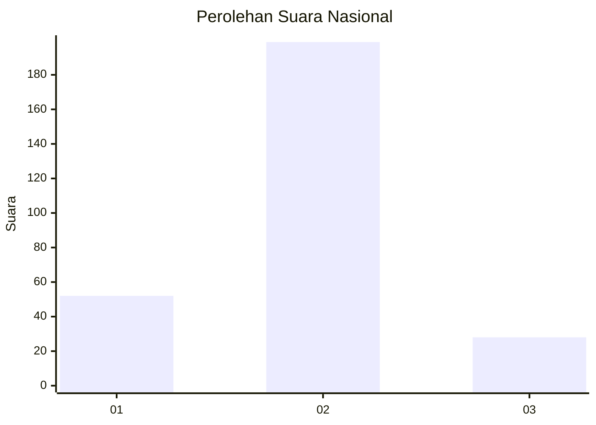
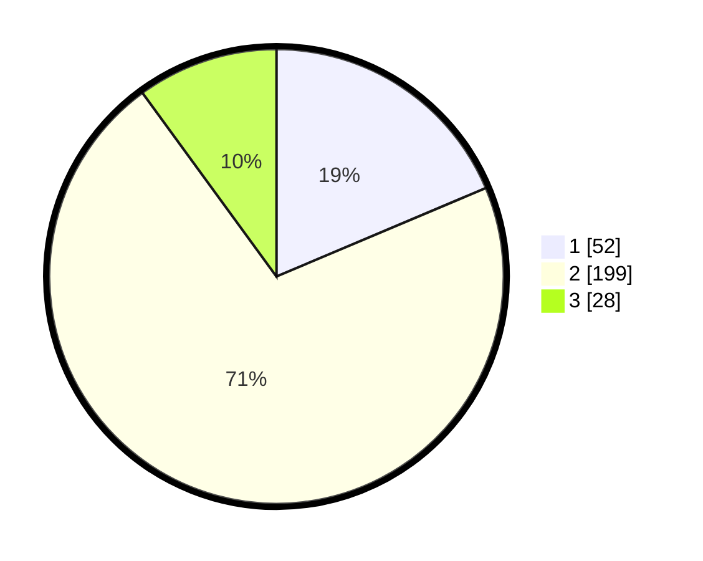

# Hasil

## Grafik

## Tabel

| No. | Nama Paslon    | Suara | Suara (raw) | Persentase |
|:--- |:-------------- | -----:| -----------:| ----------:|
| 1   | ANIES MUHAIMIN | 52    | [52][p-1]   | 18,64      |
| 2   | PRABOWO GIBRAN | 199   | [199][p-2]  | 71,33      |
| 3   | GANJAR MAHFUD  | 28    | [28][p-3]   | 10,04      |

[p-1]: https://github.com/gigit-pemilu/pemilu-2024/blob/main/pilpres/hitung-suara/sub/62-kalimantan-tengah/sub/71-kota-palangkaraya/sub/03-jekan-raya/sub/1001-palangka/sub/044-tps/sub/paslon-1.txt
[p-2]: https://github.com/gigit-pemilu/pemilu-2024/blob/main/pilpres/hitung-suara/sub/62-kalimantan-tengah/sub/71-kota-palangkaraya/sub/03-jekan-raya/sub/1001-palangka/sub/044-tps/sub/paslon-2.txt
[p-3]: https://github.com/gigit-pemilu/pemilu-2024/blob/main/pilpres/hitung-suara/sub/62-kalimantan-tengah/sub/71-kota-palangkaraya/sub/03-jekan-raya/sub/1001-palangka/sub/044-tps/sub/paslon-3.txt

## Foto C Plano

https://sirekap-obj-formc.kpu.go.id/c389/pemilu/ppwp/62/71/03/10/01/6271031001044-20240215-040219--4b199dc2-d4e5-4ed4-866b-337a928b468c.jpg

https://sirekap-obj-formc.kpu.go.id/c389/pemilu/ppwp/62/71/03/10/01/6271031001044-20240215-040048--a224f145-b5da-4a52-8704-1b5f88ffffeb.jpg

https://sirekap-obj-formc.kpu.go.id/c389/pemilu/ppwp/62/71/03/10/01/6271031001044-20240215-040245--f7cec6e5-6651-4d01-a59d-536a7230093d.jpg

## Metadata

| Key        | Value               |
| ---------- | ------------------- |
| Time Stamp | 2024-02-25 01:00:00 |

