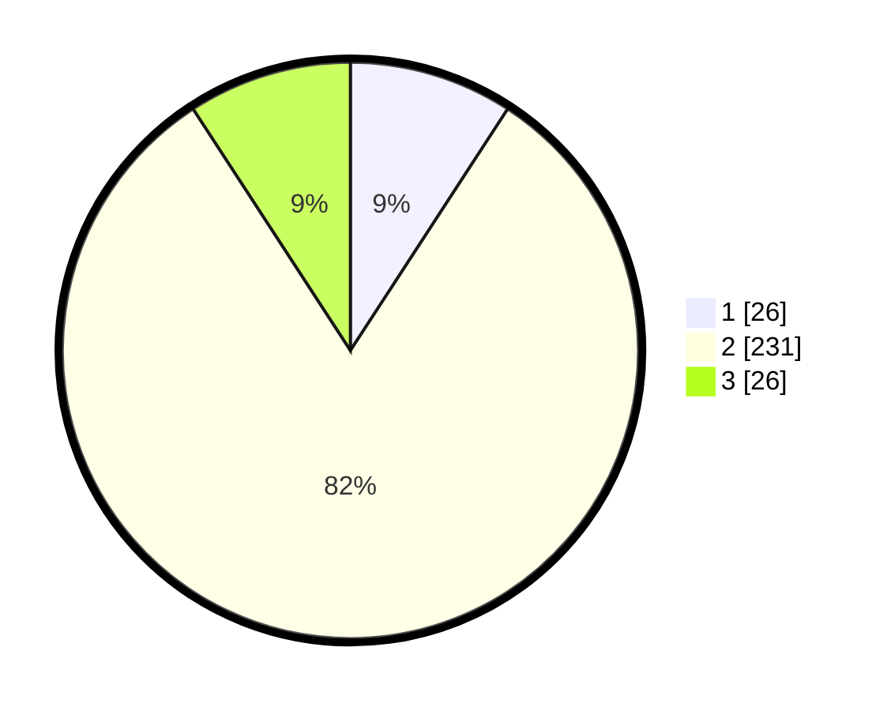

# Hasil

## Grafik

## Tabel

| No. | Nama Paslon    | Suara | Suara (raw) | Persentase |
|:--- |:-------------- | -----:| -----------:| ----------:|
| 1   | ANIES MUHAIMIN | 26    | [26][p-1]   | 9,19       |
| 2   | PRABOWO GIBRAN | 231   | [231][p-2]  | 81,63      |
| 3   | GANJAR MAHFUD  | 26    | [26][p-3]   | 9,19       |

[p-1]: https://github.com/gigit-pemilu/pemilu-2024-62-kalimantan-tengah/blob/main/pilpres/hitung-suara/sub/62-kalimantan-tengah/sub/71-kota-palangkaraya/sub/03-jekan-raya/sub/1001-palangka/sub/085-tps/sub/paslon-1.txt
[p-2]: https://github.com/gigit-pemilu/pemilu-2024-62-kalimantan-tengah/blob/main/pilpres/hitung-suara/sub/62-kalimantan-tengah/sub/71-kota-palangkaraya/sub/03-jekan-raya/sub/1001-palangka/sub/085-tps/sub/paslon-2.txt
[p-3]: https://github.com/gigit-pemilu/pemilu-2024-62-kalimantan-tengah/blob/main/pilpres/hitung-suara/sub/62-kalimantan-tengah/sub/71-kota-palangkaraya/sub/03-jekan-raya/sub/1001-palangka/sub/085-tps/sub/paslon-3.txt

## Foto C Plano

https://sirekap-obj-formc.kpu.go.id/f122/pemilu/ppwp/62/71/03/10/01/6271031001085-20240215-035736--b46cc7e3-6699-4fbb-b917-1444bf6b03f1.jpg

https://sirekap-obj-formc.kpu.go.id/f122/pemilu/ppwp/62/71/03/10/01/6271031001085-20240215-035903--89b6e41f-022d-4570-bcfc-adb658168e82.jpg

https://sirekap-obj-formc.kpu.go.id/f122/pemilu/ppwp/62/71/03/10/01/6271031001085-20240215-035909--a4619413-5c1f-49de-a49e-2c0998e50de5.jpg

## Metadata

| Key        | Value               |
| ---------- | ------------------- |
| Time Stamp | 2024-02-25 13:00:00 |

