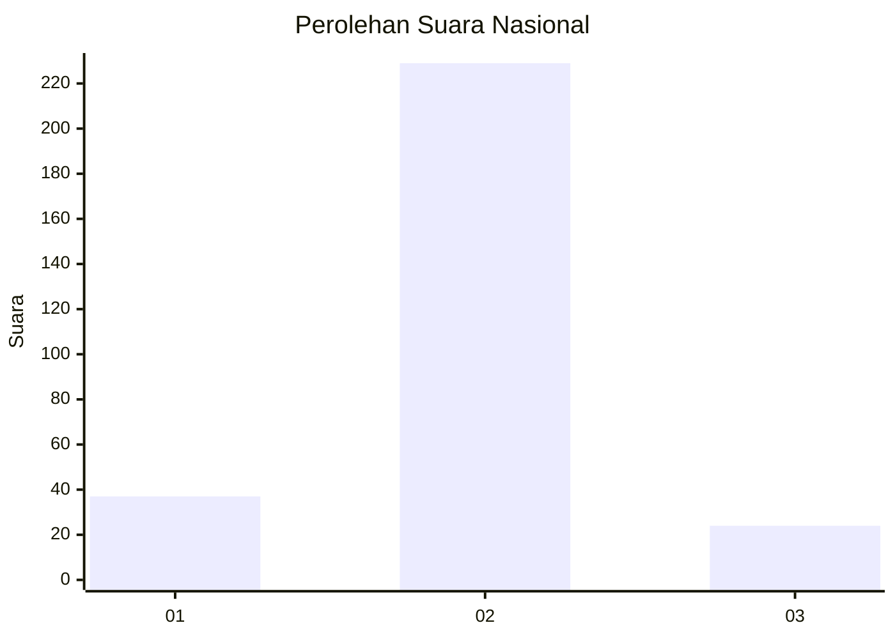
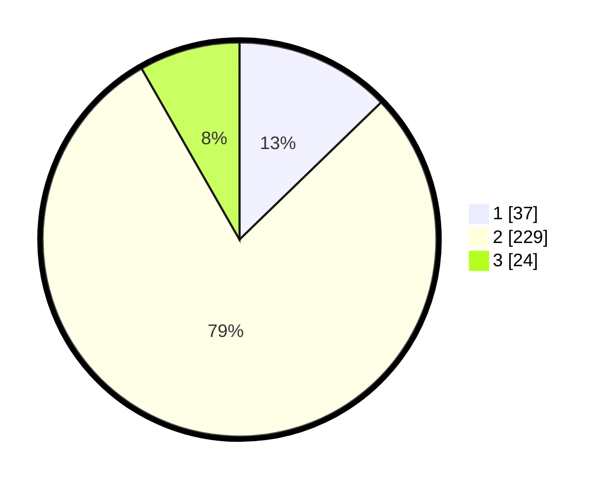

# Hasil

## Grafik

## Tabel

| No. | Nama Paslon    | Suara | Suara (raw) | Persentase |
|:--- |:-------------- | -----:| -----------:| ----------:|
| 1   | ANIES MUHAIMIN | 37    | [37][p-1]   | 12,76      |
| 2   | PRABOWO GIBRAN | 229   | [229][p-2]  | 78,97      |
| 3   | GANJAR MAHFUD  | 24    | [24][p-3]   | 8,28       |

[p-1]: https://github.com/gigit-pemilu/pemilu-2024/blob/main/pilpres/hitung-suara/sub/62-kalimantan-tengah/sub/71-kota-palangkaraya/sub/03-jekan-raya/sub/1001-palangka/sub/116-tps/sub/paslon-1.txt
[p-2]: https://github.com/gigit-pemilu/pemilu-2024/blob/main/pilpres/hitung-suara/sub/62-kalimantan-tengah/sub/71-kota-palangkaraya/sub/03-jekan-raya/sub/1001-palangka/sub/116-tps/sub/paslon-2.txt
[p-3]: https://github.com/gigit-pemilu/pemilu-2024/blob/main/pilpres/hitung-suara/sub/62-kalimantan-tengah/sub/71-kota-palangkaraya/sub/03-jekan-raya/sub/1001-palangka/sub/116-tps/sub/paslon-3.txt

## Foto C Plano

https://sirekap-obj-formc.kpu.go.id/ede4/pemilu/ppwp/62/71/03/10/01/6271031001116-20240214-204711--a48fdd69-bdbe-4e75-b487-5c849d8d73b1.jpg

https://sirekap-obj-formc.kpu.go.id/ede4/pemilu/ppwp/62/71/03/10/01/6271031001116-20240214-204836--48309b46-2af6-489c-a366-4454b59aa44c.jpg

https://sirekap-obj-formc.kpu.go.id/ede4/pemilu/ppwp/62/71/03/10/01/6271031001116-20240214-205226--d3ea1147-1774-42c1-8c5e-8325ed925869.jpg

## Metadata

| Key        | Value               |
| ---------- | ------------------- |
| Time Stamp | 2024-02-24 22:31:28 |

