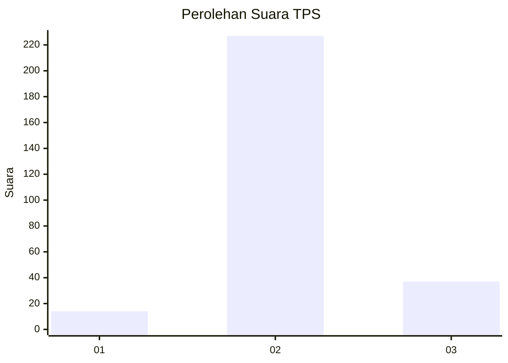
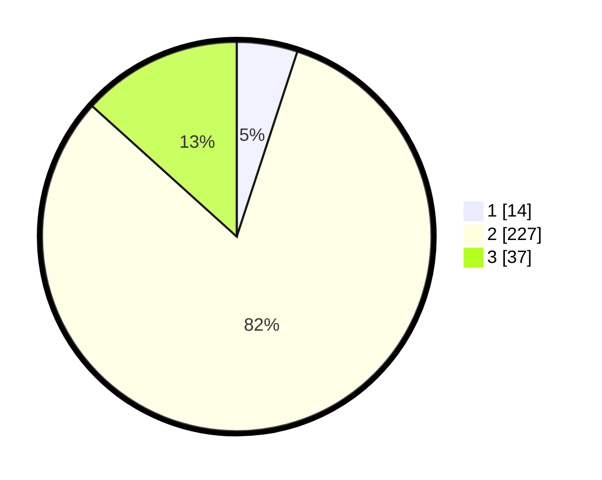

# Hasil

## Grafik

## Tabel

| No. | Nama Paslon    | Suara | Suara (raw) | Persentase |
|:--- |:-------------- | -----:| -----------:| ----------:|
| 1   | ANIES MUHAIMIN | 14    | [14][p-1]   | 5,04       |
| 2   | PRABOWO GIBRAN | 227   | [227][p-2]  | 81,65      |
| 3   | GANJAR MAHFUD  | 37    | [37][p-3]   | 13,31      |

[p-1]: https://github.com/gigit-pemilu/pemilu-2024-62-kalimantan-tengah/blob/main/pilpres/hitung-suara/sub/62-kalimantan-tengah/sub/71-kota-palangkaraya/sub/03-jekan-raya/sub/1001-palangka/sub/122-tps/sub/paslon-1.txt
[p-2]: https://github.com/gigit-pemilu/pemilu-2024-62-kalimantan-tengah/blob/main/pilpres/hitung-suara/sub/62-kalimantan-tengah/sub/71-kota-palangkaraya/sub/03-jekan-raya/sub/1001-palangka/sub/122-tps/sub/paslon-2.txt
[p-3]: https://github.com/gigit-pemilu/pemilu-2024-62-kalimantan-tengah/blob/main/pilpres/hitung-suara/sub/62-kalimantan-tengah/sub/71-kota-palangkaraya/sub/03-jekan-raya/sub/1001-palangka/sub/122-tps/sub/paslon-3.txt

## Foto C Plano

https://sirekap-obj-formc.kpu.go.id/b90c/pemilu/ppwp/62/71/03/10/01/6271031001122-20240214-233113--36b0f262-0404-4175-a98f-68cf6496d051.jpg

https://sirekap-obj-formc.kpu.go.id/b90c/pemilu/ppwp/62/71/03/10/01/6271031001122-20240214-233408--bb1d3d33-73e2-4e04-b2d9-ac24da6cb86a.jpg

https://sirekap-obj-formc.kpu.go.id/b90c/pemilu/ppwp/62/71/03/10/01/6271031001122-20240214-233503--bcfd5afd-deb6-4b38-bf94-fe10e380bffd.jpg

## Metadata

| Key        | Value               |
| ---------- | ------------------- |
| Time Stamp | 2024-02-15 19:30:26 |

