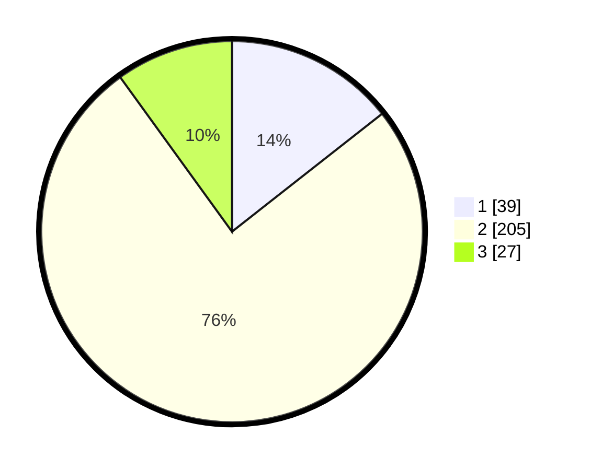

# Hasil

## Grafik

## Tabel

| No. | Nama Paslon    | Suara | Suara (raw) | Persentase |
|:--- |:-------------- | -----:| -----------:| ----------:|
| 1   | ANIES MUHAIMIN | 39    | [39][p-1]   | 14,39      |
| 2   | PRABOWO GIBRAN | 205   | [205][p-2]  | 75,65      |
| 3   | GANJAR MAHFUD  | 27    | [27][p-3]   | 9,96       |

[p-1]: https://github.com/gigit-pemilu/pemilu-2024-62-kalimantan-tengah/blob/main/pilpres/hitung-suara/sub/62-kalimantan-tengah/sub/71-kota-palangkaraya/sub/03-jekan-raya/sub/1002-menteng/sub/017-tps/sub/paslon-1.txt
[p-2]: https://github.com/gigit-pemilu/pemilu-2024-62-kalimantan-tengah/blob/main/pilpres/hitung-suara/sub/62-kalimantan-tengah/sub/71-kota-palangkaraya/sub/03-jekan-raya/sub/1002-menteng/sub/017-tps/sub/paslon-2.txt
[p-3]: https://github.com/gigit-pemilu/pemilu-2024-62-kalimantan-tengah/blob/main/pilpres/hitung-suara/sub/62-kalimantan-tengah/sub/71-kota-palangkaraya/sub/03-jekan-raya/sub/1002-menteng/sub/017-tps/sub/paslon-3.txt

## Foto C Plano

https://sirekap-obj-formc.kpu.go.id/5010/pemilu/ppwp/62/71/03/10/02/6271031002017-20240215-010249--56d8cc4b-84e9-4418-917b-d64e8d00e6d9.jpg

https://sirekap-obj-formc.kpu.go.id/5010/pemilu/ppwp/62/71/03/10/02/6271031002017-20240214-213453--cdd93287-79fe-4b19-86d7-2876d02f79f7.jpg

https://sirekap-obj-formc.kpu.go.id/5010/pemilu/ppwp/62/71/03/10/02/6271031002017-20240214-213656--50ce691e-de01-4253-8bdb-a2c97dbee8c5.jpg

## Metadata

| Key        | Value               |
| ---------- | ------------------- |
| Time Stamp | 2024-02-25 11:00:00 |

