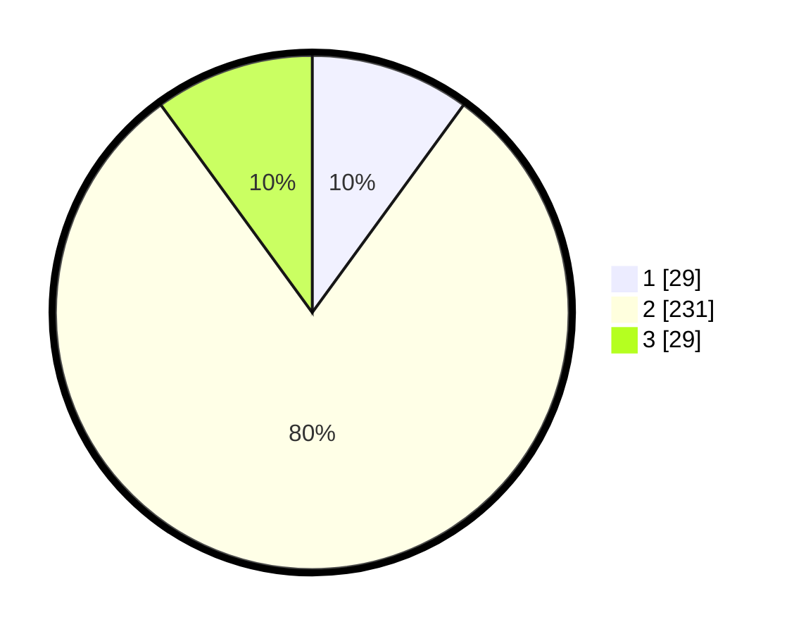

# Hasil

## Grafik

## Tabel

| No. | Nama Paslon    | Suara | Suara (raw) | Persentase |
|:--- |:-------------- | -----:| -----------:| ----------:|
| 1   | ANIES MUHAIMIN | 29    | [29][p-1]   | 10,03      |
| 2   | PRABOWO GIBRAN | 231   | [231][p-2]  | 79,93      |
| 3   | GANJAR MAHFUD  | 29    | [29][p-3]   | 10,03      |

[p-1]: https://github.com/gigit-pemilu/pemilu-2024-62-kalimantan-tengah/blob/main/pilpres/hitung-suara/sub/62-kalimantan-tengah/sub/71-kota-palangkaraya/sub/03-jekan-raya/sub/1002-menteng/sub/053-tps/sub/paslon-1.txt
[p-2]: https://github.com/gigit-pemilu/pemilu-2024-62-kalimantan-tengah/blob/main/pilpres/hitung-suara/sub/62-kalimantan-tengah/sub/71-kota-palangkaraya/sub/03-jekan-raya/sub/1002-menteng/sub/053-tps/sub/paslon-2.txt
[p-3]: https://github.com/gigit-pemilu/pemilu-2024-62-kalimantan-tengah/blob/main/pilpres/hitung-suara/sub/62-kalimantan-tengah/sub/71-kota-palangkaraya/sub/03-jekan-raya/sub/1002-menteng/sub/053-tps/sub/paslon-3.txt

## Foto C Plano

https://sirekap-obj-formc.kpu.go.id/f92d/pemilu/ppwp/62/71/03/10/02/6271031002053-20240214-233106--a58bc7ac-3917-4dc6-a755-4564d014efac.jpg

https://sirekap-obj-formc.kpu.go.id/f92d/pemilu/ppwp/62/71/03/10/02/6271031002053-20240214-233143--cd458b44-3dfb-4e9a-a32e-e02e4a19f51c.jpg

https://sirekap-obj-formc.kpu.go.id/f92d/pemilu/ppwp/62/71/03/10/02/6271031002053-20240214-233211--90e50f37-ba03-43e7-a303-ce9b4a9b864f.jpg

## Metadata

| Key        | Value               |
| ---------- | ------------------- |
| Time Stamp | 2024-02-24 22:31:28 |

