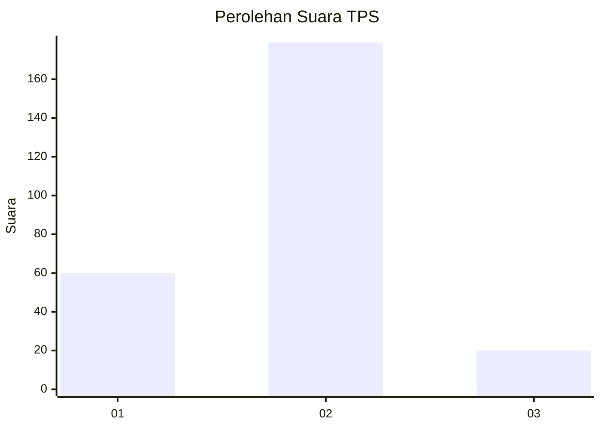
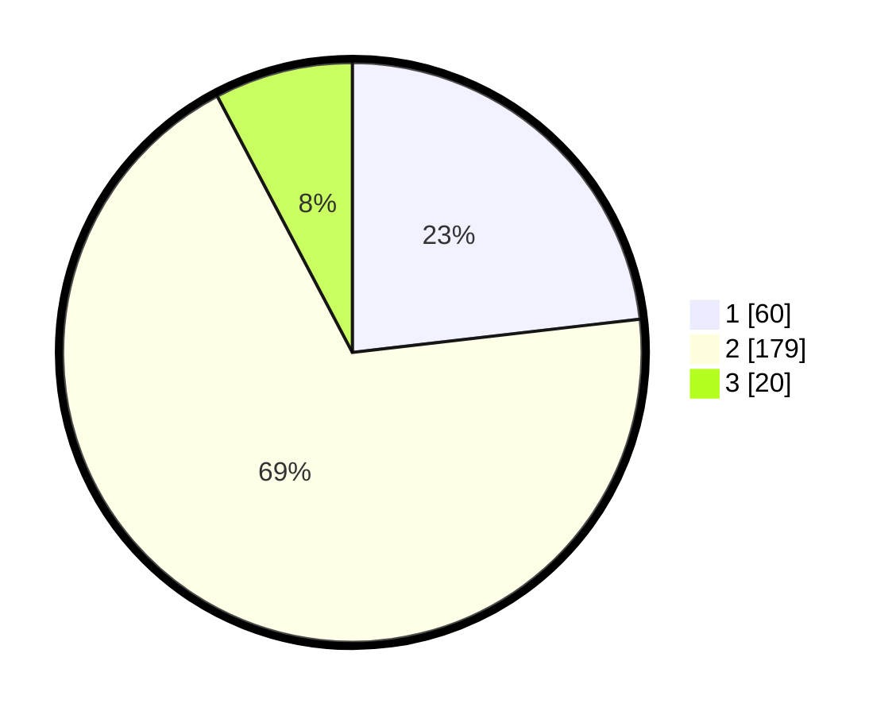

# Hasil

## Grafik

## Tabel

| No. | Nama Paslon    | Suara | Suara (raw) | Persentase |
|:--- |:-------------- | -----:| -----------:| ----------:|
| 1   | ANIES MUHAIMIN | 60    | [60][p-1]   | 23,17      |
| 2   | PRABOWO GIBRAN | 179   | [179][p-2]  | 69,11      |
| 3   | GANJAR MAHFUD  | 20    | [20][p-3]   | 7,72       |

[p-1]: https://github.com/gigit-pemilu/pemilu-2024-62-kalimantan-tengah/blob/main/pilpres/hitung-suara/sub/62-kalimantan-tengah/sub/71-kota-palangkaraya/sub/03-jekan-raya/sub/1002-menteng/sub/107-tps/sub/paslon-1.txt
[p-2]: https://github.com/gigit-pemilu/pemilu-2024-62-kalimantan-tengah/blob/main/pilpres/hitung-suara/sub/62-kalimantan-tengah/sub/71-kota-palangkaraya/sub/03-jekan-raya/sub/1002-menteng/sub/107-tps/sub/paslon-2.txt
[p-3]: https://github.com/gigit-pemilu/pemilu-2024-62-kalimantan-tengah/blob/main/pilpres/hitung-suara/sub/62-kalimantan-tengah/sub/71-kota-palangkaraya/sub/03-jekan-raya/sub/1002-menteng/sub/107-tps/sub/paslon-3.txt

## Foto C Plano

https://sirekap-obj-formc.kpu.go.id/5f06/pemilu/ppwp/62/71/03/10/02/6271031002107-20240215-065346--ce44a4c3-d36e-4563-999c-ff7d190ae0a1.jpg

https://sirekap-obj-formc.kpu.go.id/5f06/pemilu/ppwp/62/71/03/10/02/6271031002107-20240215-065725--116794af-09c0-44f3-85ae-e5173ac07728.jpg

https://sirekap-obj-formc.kpu.go.id/5f06/pemilu/ppwp/62/71/03/10/02/6271031002107-20240215-065736--50b8b4db-dc11-4ea6-b5d0-f560902bb487.jpg

## Metadata

| Key        | Value               |
| ---------- | ------------------- |
| Time Stamp | 2024-02-25 13:00:00 |

