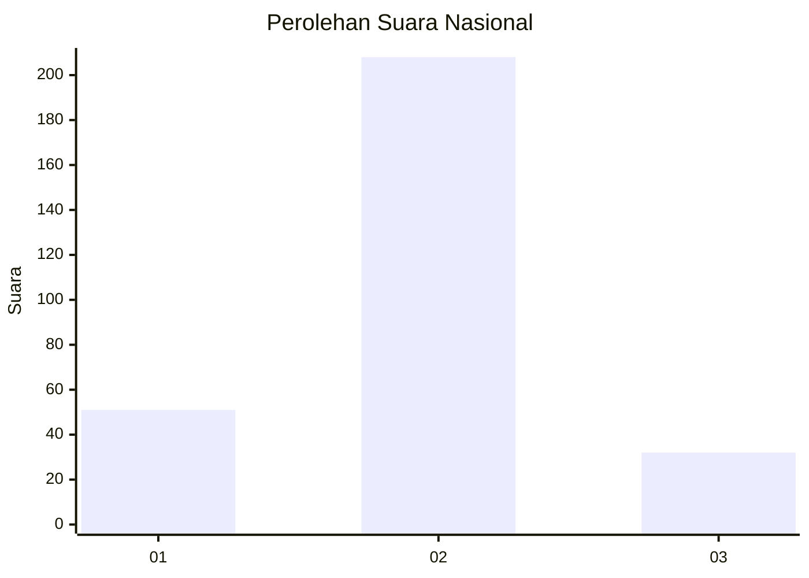
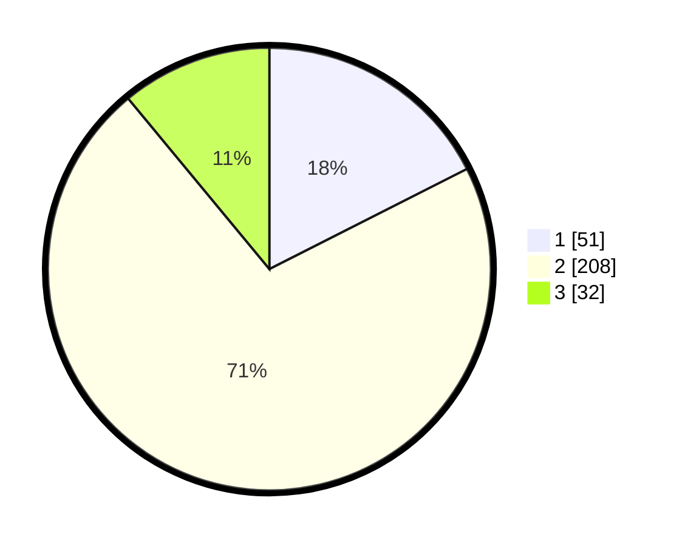

# Hasil

## Grafik

## Tabel

| No. | Nama Paslon    | Suara | Suara (raw) | Persentase |
|:--- |:-------------- | -----:| -----------:| ----------:|
| 1   | ANIES MUHAIMIN | 51    | [51][p-1]   | 17,53      |
| 2   | PRABOWO GIBRAN | 208   | [208][p-2]  | 71,48      |
| 3   | GANJAR MAHFUD  | 32    | [32][p-3]   | 11,00      |

[p-1]: https://github.com/gigit-pemilu/pemilu-2024/blob/main/pilpres/hitung-suara/sub/62-kalimantan-tengah/sub/71-kota-palangkaraya/sub/03-jekan-raya/sub/1002-menteng/sub/118-tps/sub/paslon-1.txt
[p-2]: https://github.com/gigit-pemilu/pemilu-2024/blob/main/pilpres/hitung-suara/sub/62-kalimantan-tengah/sub/71-kota-palangkaraya/sub/03-jekan-raya/sub/1002-menteng/sub/118-tps/sub/paslon-2.txt
[p-3]: https://github.com/gigit-pemilu/pemilu-2024/blob/main/pilpres/hitung-suara/sub/62-kalimantan-tengah/sub/71-kota-palangkaraya/sub/03-jekan-raya/sub/1002-menteng/sub/118-tps/sub/paslon-3.txt

## Foto C Plano

https://sirekap-obj-formc.kpu.go.id/1cc6/pemilu/ppwp/62/71/03/10/02/6271031002118-20240214-233814--9cf690b5-19c7-4fc1-b200-d2ac2275033a.jpg

https://sirekap-obj-formc.kpu.go.id/1cc6/pemilu/ppwp/62/71/03/10/02/6271031002118-20240214-233912--a191aea4-e9a4-4a74-a4b1-8b1f3be01a01.jpg

https://sirekap-obj-formc.kpu.go.id/1cc6/pemilu/ppwp/62/71/03/10/02/6271031002118-20240214-234048--6b5c034a-291d-42e3-9d67-40ee40746813.jpg

## Metadata

| Key        | Value               |
| ---------- | ------------------- |
| Time Stamp | 2024-02-24 22:31:28 |

