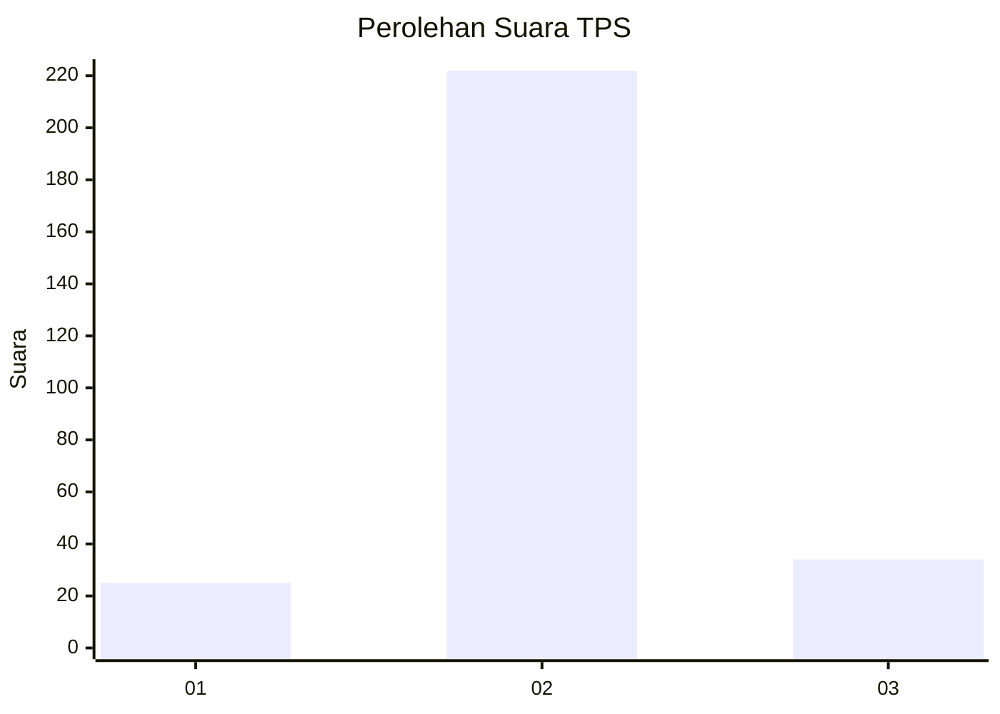
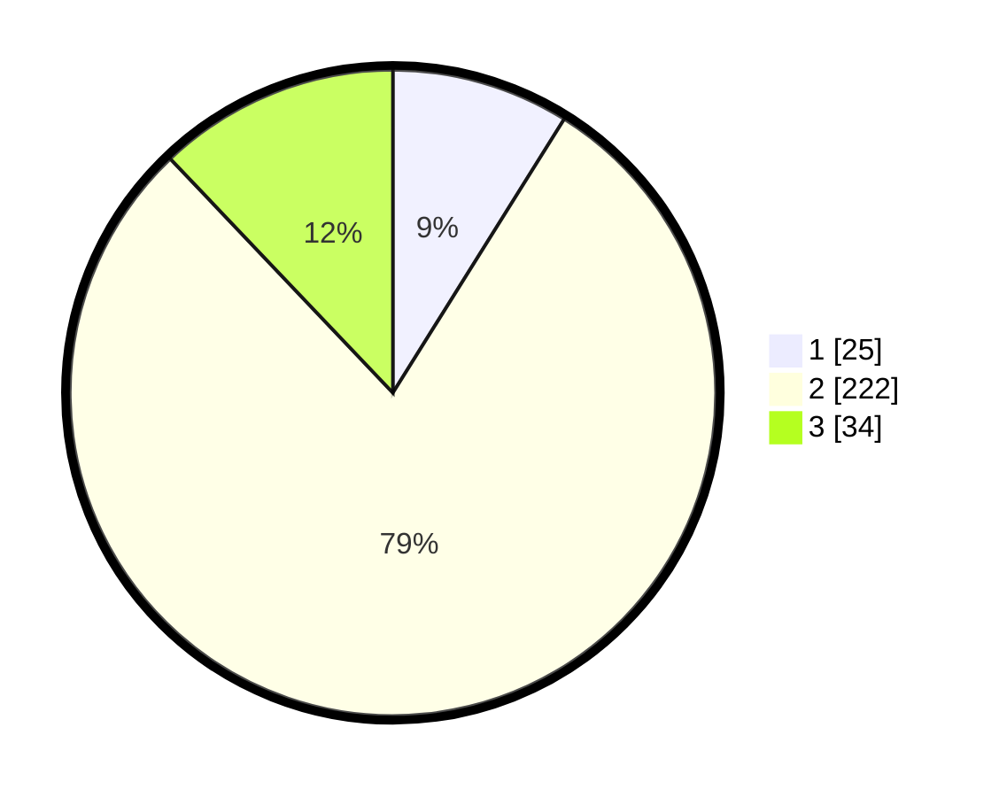

# Hasil

## Grafik

## Tabel

| No. | Nama Paslon    | Suara | Suara (raw) | Persentase |
|:--- |:-------------- | -----:| -----------:| ----------:|
| 1   | ANIES MUHAIMIN | 25    | [25][p-1]   | 8,90       |
| 2   | PRABOWO GIBRAN | 222   | [222][p-2]  | 79,00      |
| 3   | GANJAR MAHFUD  | 34    | [34][p-3]   | 12,10      |

[p-1]: https://github.com/gigit-pemilu/pemilu-2024-62-kalimantan-tengah/blob/main/pilpres/hitung-suara/sub/62-kalimantan-tengah/sub/71-kota-palangkaraya/sub/03-jekan-raya/sub/1003-bukit-tunggal/sub/138-tps/sub/paslon-1.txt
[p-2]: https://github.com/gigit-pemilu/pemilu-2024-62-kalimantan-tengah/blob/main/pilpres/hitung-suara/sub/62-kalimantan-tengah/sub/71-kota-palangkaraya/sub/03-jekan-raya/sub/1003-bukit-tunggal/sub/138-tps/sub/paslon-2.txt
[p-3]: https://github.com/gigit-pemilu/pemilu-2024-62-kalimantan-tengah/blob/main/pilpres/hitung-suara/sub/62-kalimantan-tengah/sub/71-kota-palangkaraya/sub/03-jekan-raya/sub/1003-bukit-tunggal/sub/138-tps/sub/paslon-3.txt

## Foto C Plano

https://sirekap-obj-formc.kpu.go.id/03af/pemilu/ppwp/62/71/03/10/03/6271031003138-20240216-072204--0318bd82-4953-4daa-9beb-acb5106533e8.jpg

https://sirekap-obj-formc.kpu.go.id/03af/pemilu/ppwp/62/71/03/10/03/6271031003138-20240216-072215--25693417-d7af-443b-8a21-7108ab073b9c.jpg

https://sirekap-obj-formc.kpu.go.id/03af/pemilu/ppwp/62/71/03/10/03/6271031003138-20240216-072223--0d3917bb-efc3-40b5-ad5b-668c8732c809.jpg

## Metadata

| Key        | Value               |
| ---------- | ------------------- |
| Time Stamp | 2024-02-25 16:00:00 |

