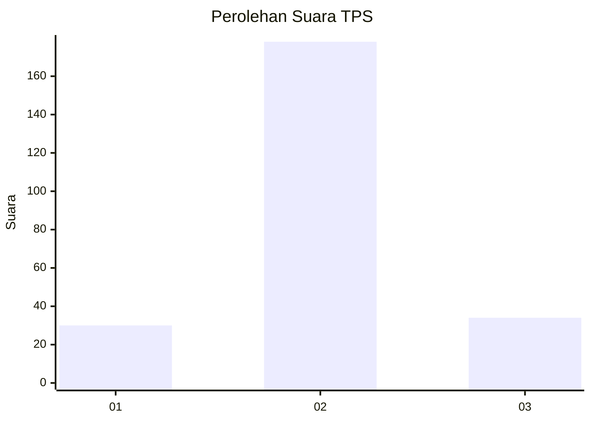
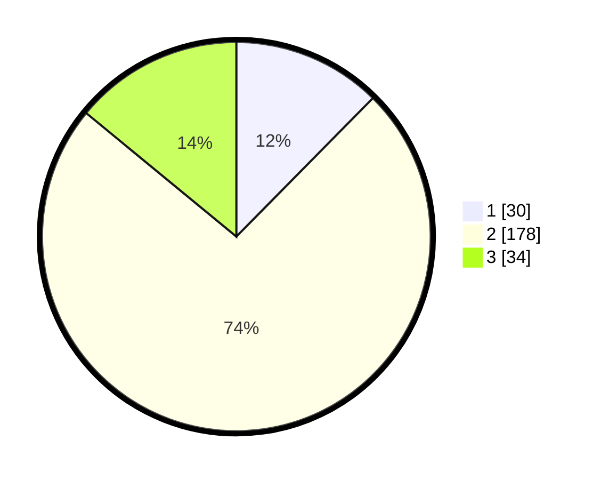

# Hasil

## Grafik

## Tabel

| No. | Nama Paslon    | Suara | Suara (raw) | Persentase |
|:--- |:-------------- | -----:| -----------:| ----------:|
| 1   | ANIES MUHAIMIN | 30    | [30][p-1]   | 12,40      |
| 2   | PRABOWO GIBRAN | 178   | [178][p-2]  | 73,55      |
| 3   | GANJAR MAHFUD  | 34    | [34][p-3]   | 14,05      |

[p-1]: https://github.com/gigit-pemilu/pemilu-2024-62-kalimantan-tengah/blob/main/pilpres/hitung-suara/sub/62-kalimantan-tengah/sub/71-kota-palangkaraya/sub/04-sabangau/sub/1002-kalampangan/sub/004-tps/sub/paslon-1.txt
[p-2]: https://github.com/gigit-pemilu/pemilu-2024-62-kalimantan-tengah/blob/main/pilpres/hitung-suara/sub/62-kalimantan-tengah/sub/71-kota-palangkaraya/sub/04-sabangau/sub/1002-kalampangan/sub/004-tps/sub/paslon-2.txt
[p-3]: https://github.com/gigit-pemilu/pemilu-2024-62-kalimantan-tengah/blob/main/pilpres/hitung-suara/sub/62-kalimantan-tengah/sub/71-kota-palangkaraya/sub/04-sabangau/sub/1002-kalampangan/sub/004-tps/sub/paslon-3.txt

## Foto C Plano

https://sirekap-obj-formc.kpu.go.id/0b8f/pemilu/ppwp/62/71/04/10/02/6271041002004-20240215-013438--139947ea-1290-4d55-a52f-a438f30bdbe3.jpg

https://sirekap-obj-formc.kpu.go.id/0b8f/pemilu/ppwp/62/71/04/10/02/6271041002004-20240215-013536--22bb316d-47e2-4801-bd8b-7ad2f5022dd9.jpg

https://sirekap-obj-formc.kpu.go.id/0b8f/pemilu/ppwp/62/71/04/10/02/6271041002004-20240215-013647--df54d7fe-bd1d-4855-8bd5-1ba42a5217bf.jpg

## Metadata

| Key        | Value               |
| ---------- | ------------------- |
| Time Stamp | 2024-02-15 15:00:29 |

