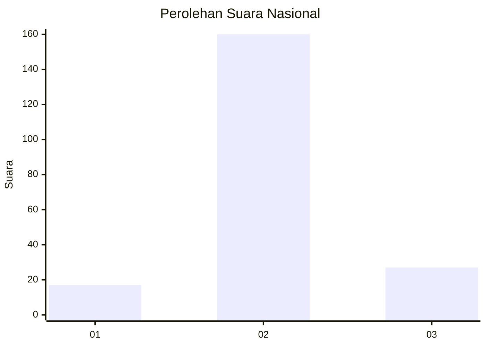
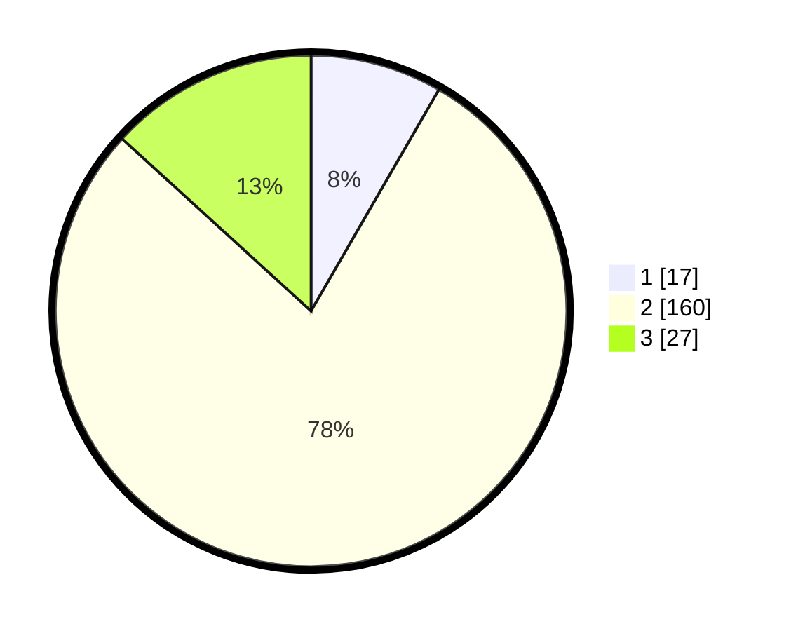

# Hasil

## Grafik

## Tabel

| No. | Nama Paslon    | Suara | Suara (raw) | Persentase |
|:--- |:-------------- | -----:| -----------:| ----------:|
| 1   | ANIES MUHAIMIN | 17    | [17][p-1]   | 8,33       |
| 2   | PRABOWO GIBRAN | 160   | [160][p-2]  | 78,43      |
| 3   | GANJAR MAHFUD  | 27    | [27][p-3]   | 13,24      |

[p-1]: https://github.com/gigit-pemilu/pemilu-2024/blob/main/pilpres/hitung-suara/sub/62-kalimantan-tengah/sub/71-kota-palangkaraya/sub/04-sabangau/sub/1003-kereng-bangkirai/sub/011-tps/sub/paslon-1.txt
[p-2]: https://github.com/gigit-pemilu/pemilu-2024/blob/main/pilpres/hitung-suara/sub/62-kalimantan-tengah/sub/71-kota-palangkaraya/sub/04-sabangau/sub/1003-kereng-bangkirai/sub/011-tps/sub/paslon-2.txt
[p-3]: https://github.com/gigit-pemilu/pemilu-2024/blob/main/pilpres/hitung-suara/sub/62-kalimantan-tengah/sub/71-kota-palangkaraya/sub/04-sabangau/sub/1003-kereng-bangkirai/sub/011-tps/sub/paslon-3.txt

## Foto C Plano

https://sirekap-obj-formc.kpu.go.id/e01d/pemilu/ppwp/62/71/04/10/03/6271041003011-20240215-043955--7cb7d0ee-83a7-41d8-ad78-667b4d633b21.jpg

https://sirekap-obj-formc.kpu.go.id/e01d/pemilu/ppwp/62/71/04/10/03/6271041003011-20240215-044112--d55d5e23-88fc-48f6-a59c-a4f1f0a7d01a.jpg

https://sirekap-obj-formc.kpu.go.id/e01d/pemilu/ppwp/62/71/04/10/03/6271041003011-20240215-044232--1d1ee1f2-7f23-45a5-8894-ffeb88eecbab.jpg

## Metadata

| Key        | Value               |
| ---------- | ------------------- |
| Time Stamp | 2024-03-01 23:00:00 |

