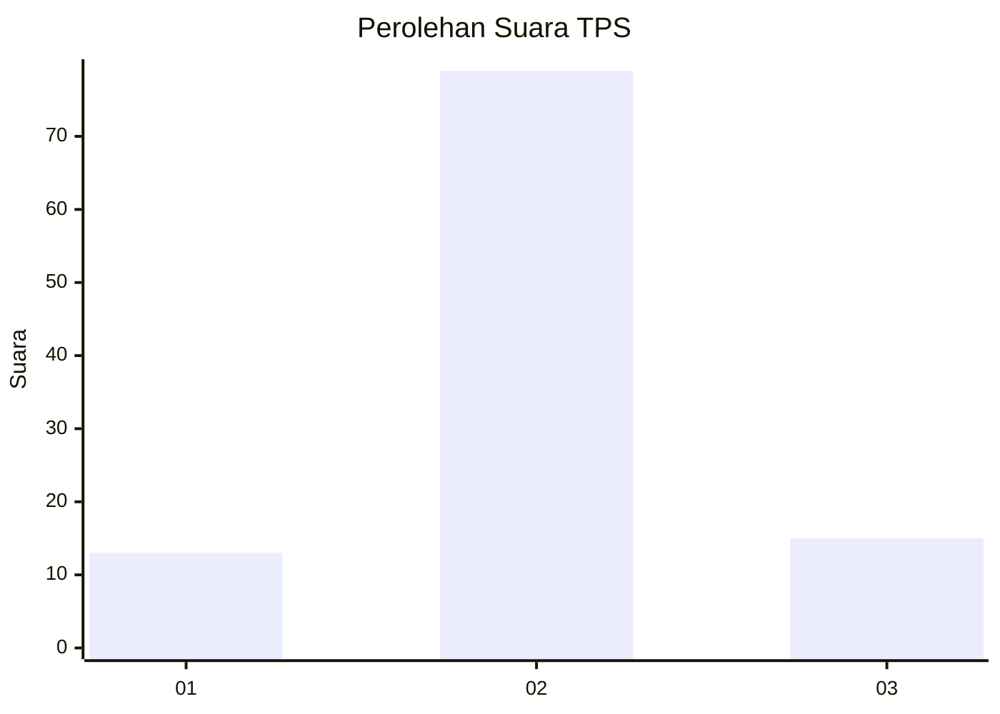
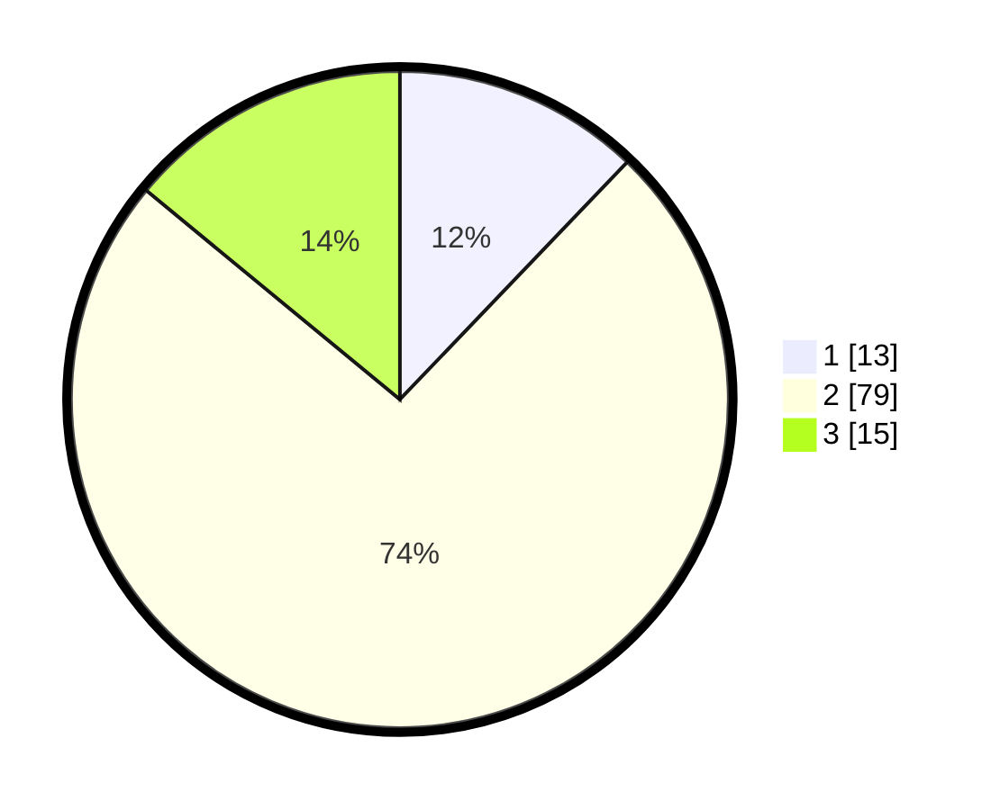

# Hasil

## Grafik

## Tabel

| No. | Nama Paslon    | Suara | Suara (raw) | Persentase |
|:--- |:-------------- | -----:| -----------:| ----------:|
| 1   | ANIES MUHAIMIN | 13    | [13][p-1]   | 12,15      |
| 2   | PRABOWO GIBRAN | 79    | [79][p-2]   | 73,83      |
| 3   | GANJAR MAHFUD  | 15    | [15][p-3]   | 14,02      |

[p-1]: https://github.com/gigit-pemilu/pemilu-2024-62-kalimantan-tengah/blob/main/pilpres/hitung-suara/sub/62-kalimantan-tengah/sub/71-kota-palangkaraya/sub/04-sabangau/sub/1006-sabaru/sub/003-tps/sub/paslon-1.txt
[p-2]: https://github.com/gigit-pemilu/pemilu-2024-62-kalimantan-tengah/blob/main/pilpres/hitung-suara/sub/62-kalimantan-tengah/sub/71-kota-palangkaraya/sub/04-sabangau/sub/1006-sabaru/sub/003-tps/sub/paslon-2.txt
[p-3]: https://github.com/gigit-pemilu/pemilu-2024-62-kalimantan-tengah/blob/main/pilpres/hitung-suara/sub/62-kalimantan-tengah/sub/71-kota-palangkaraya/sub/04-sabangau/sub/1006-sabaru/sub/003-tps/sub/paslon-3.txt

## Foto C Plano

https://sirekap-obj-formc.kpu.go.id/066c/pemilu/ppwp/62/71/04/10/06/6271041006003-20240214-192703--c30978a2-d490-420f-a91e-f7d33ad7096f.jpg

https://sirekap-obj-formc.kpu.go.id/066c/pemilu/ppwp/62/71/04/10/06/6271041006003-20240214-192728--21df5d49-c400-4f55-8580-578ea9cc175b.jpg

https://sirekap-obj-formc.kpu.go.id/066c/pemilu/ppwp/62/71/04/10/06/6271041006003-20240214-192748--903520a2-3745-473f-a02b-ee8fa6d9d204.jpg

## Metadata

| Key        | Value               |
| ---------- | ------------------- |
| Time Stamp | 2024-02-25 23:00:00 |

